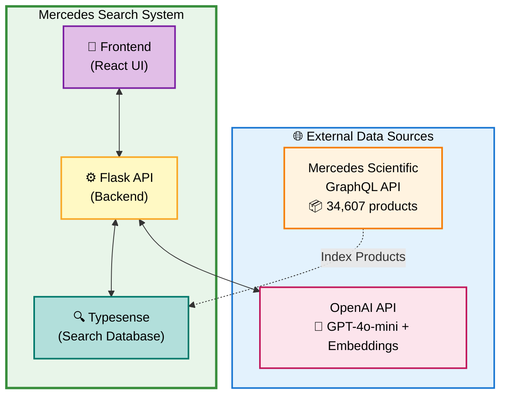
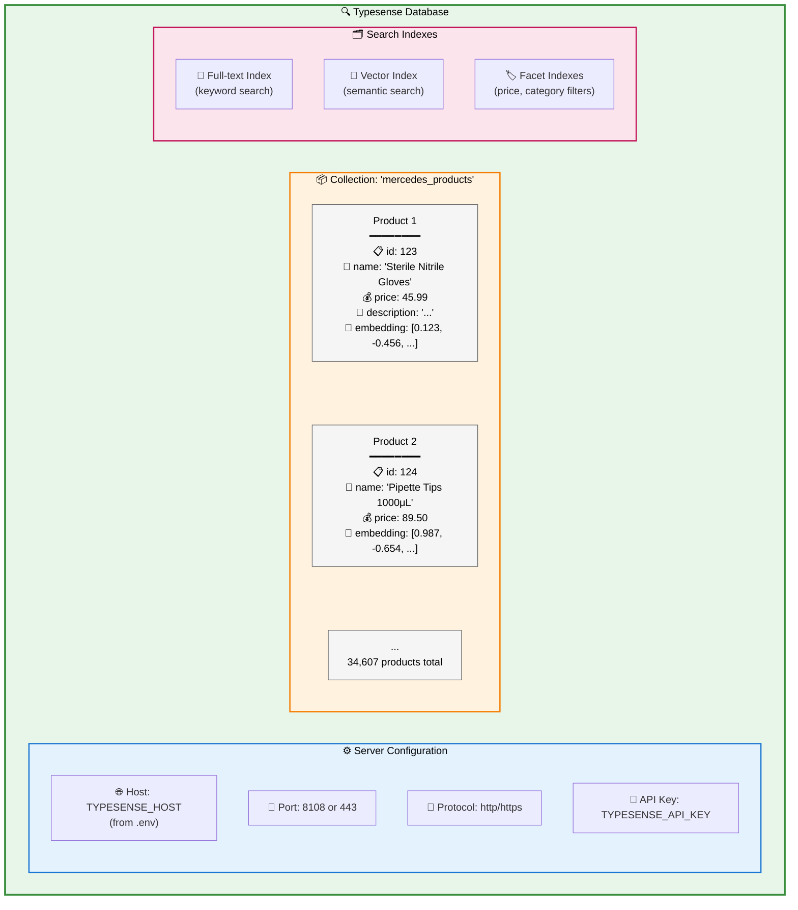
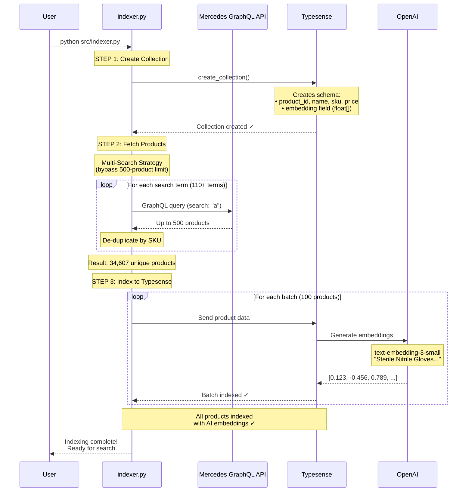
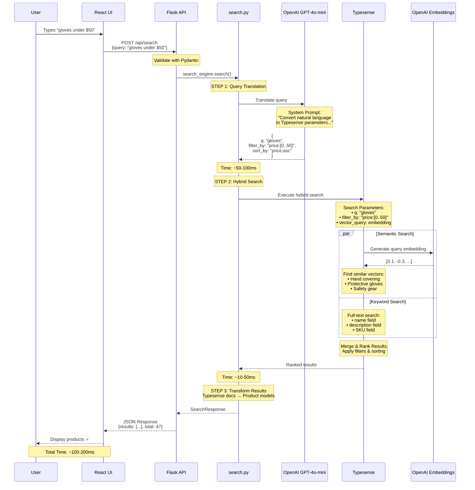
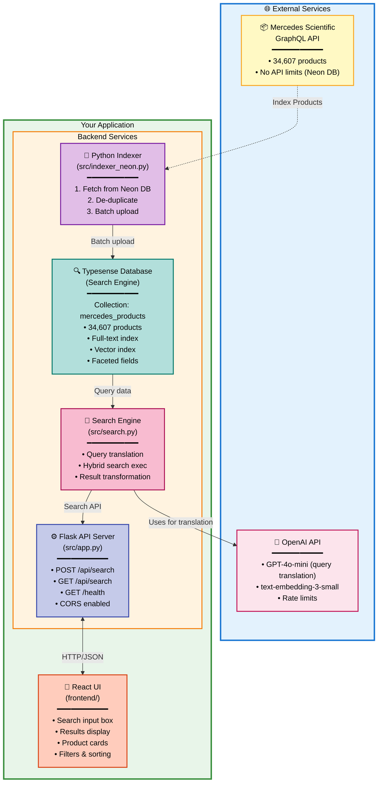
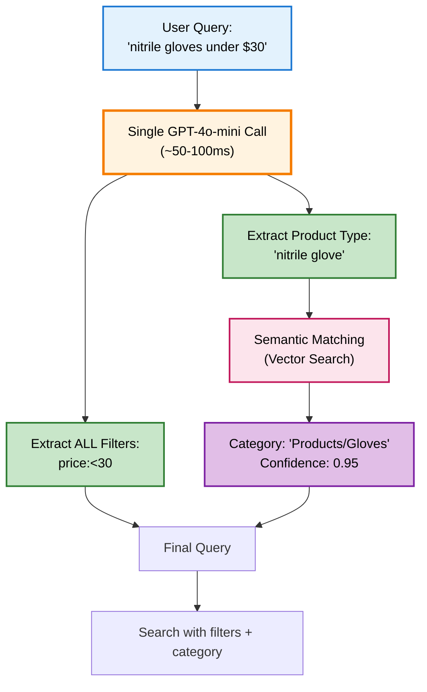
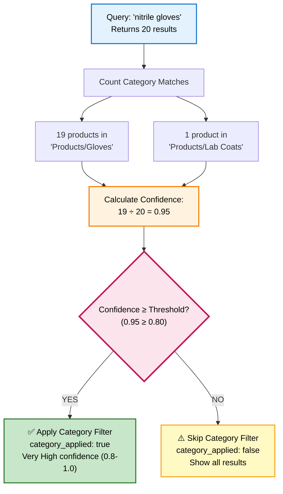
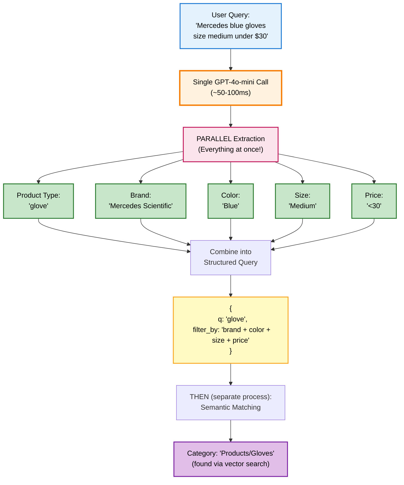
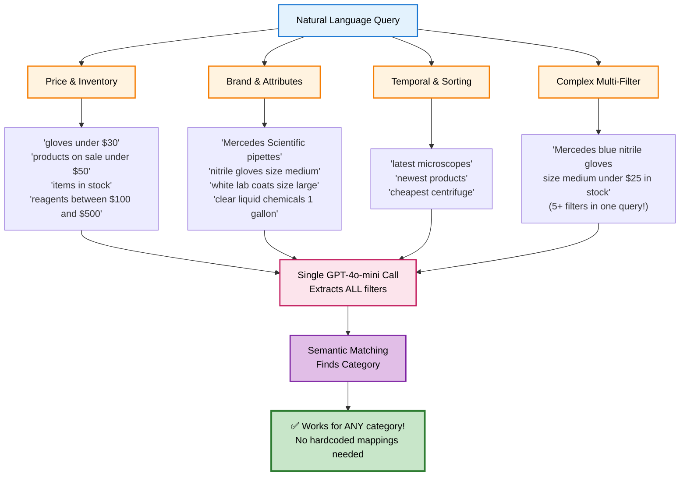

# How Mercedes Natural Language Search Works

**Complete System Explanation with Flowcharts**

---

## Table of Contents
1. [System Overview](#system-overview)
2. [Where is Data Stored?](#where-is-data-stored)
3. [Complete Data Flow](#complete-data-flow)
4. [Component Breakdown](#component-breakdown)
5. [Detailed Process Flows](#detailed-process-flows)
6. [Advanced Features: Category Detection & Scalability](#advanced-features-category-detection--scalability)

---

## System Overview

This is a **hybrid search system** that combines semantic AI search with traditional keyword search to find medical/scientific products using natural language queries.

### The Big Picture



---

## Where is Data Stored?

### The `mercedes_products` Collection

**Answer**: The collection is stored in **Typesense**, which is a separate search engine database (similar to Elasticsearch).



### Configuration (src/config.py)

```python
# Where Typesense is located
TYPESENSE_HOST = os.getenv("TYPESENSE_HOST", "localhost")
TYPESENSE_PORT = int(os.getenv("TYPESENSE_PORT", "8108"))
TYPESENSE_PROTOCOL = os.getenv("TYPESENSE_PROTOCOL", "http")
TYPESENSE_API_KEY = os.getenv("TYPESENSE_API_KEY")

# Collection name (where products are stored)
TYPESENSE_COLLECTION_NAME = "mercedes_products"
```

**Types of Typesense Deployments:**
- **Local**: Running on your computer (localhost:8108)
- **Cloud**: Running on Typesense Cloud (cloud.typesense.org)
- **Self-hosted**: Running on your own server

---

## Complete Data Flow

### Phase 1: Indexing (One-Time Setup)

This happens when you run `python src/indexer.py`:



**Time**: ~10-20 minutes for 5,000-10,000 products

---

### Phase 2: Searching (Runtime)

This happens when a user searches:



**Total Time**: ~100-200ms

---

## Component Breakdown

### 1. Configuration (src/config.py)

**Purpose**: Central configuration management

**What it does:**
- Loads environment variables from `.env` file
- Stores API keys (OpenAI, Typesense)
- Stores connection settings (URLs, ports)
- Validates required settings on startup

**Key Settings:**
```python
OPENAI_API_KEY          # For GPT-4 and embeddings
OPENAI_MODEL            # gpt-4 (query translation)
OPENAI_EMBEDDING_MODEL  # text-embedding-3-small (vectors)

TYPESENSE_HOST          # Where Typesense is running
TYPESENSE_PORT          # Connection port
TYPESENSE_API_KEY       # Authentication
TYPESENSE_COLLECTION_NAME = "mercedes_products"  ← Collection name!

MERCEDES_GRAPHQL_URL    # Where to fetch products from
```

---

### 2. Data Models (src/models.py)

**Purpose**: Type-safe data validation with Pydantic

**Models:**
```python
SearchQuery         # User input validation
  ├─ query: str
  └─ max_results: int

SearchResponse      # API response format
  ├─ results: List[Product]
  ├─ total: int
  ├─ query_time_ms: float
  └─ typesense_query: dict

Product            # Product data structure
  ├─ product_id, name, sku
  ├─ price, currency
  ├─ description, categories
  └─ stock_status, image_url

TypesenseQuery     # Internal search parameters
  ├─ q: str
  ├─ filter_by: Optional[str]
  ├─ sort_by: Optional[str]
  └─ per_page: int
```

---

### 3. Indexer (src/indexer.py)

**Purpose**: Fetch products from Mercedes API and index to Typesense

**Flow:**
```
MercedesProductIndexer.run()
    ↓
1. create_collection()
   └─ Creates "mercedes_products" collection
   └─ Defines schema with embedding field
    ↓
2. fetch_products()
   ├─ _get_search_terms() → 110+ search terms
   └─ _fetch_products_for_search() for each term
       ├─ Query GraphQL API
       ├─ Get up to 500 products per term
       └─ De-duplicate by SKU
   Result: 5,000-10,000+ unique products
    ↓
3. index_products()
   └─ Batch upload to Typesense (100 per batch)
   └─ Typesense auto-generates embeddings via OpenAI
```

**Why Multi-Search?**
```
Mercedes GraphQL API Limitation:
┌────────────────────────────────────────┐
│ Max products per query: 500            │
│ No matter what search term you use!    │
└────────────────────────────────────────┘

Solution: Multiple searches with different terms
┌─────────────────────────────────────────────────────┐
│ Search "a"          →  500 products (100 unique)    │
│ Search "b"          →  500 products (98 unique)     │
│ Search "gloves"     →  500 products (450 unique)    │
│ Search "pipette"    →  500 products (480 unique)    │
│ ...                                                  │
│ (110+ search terms)                                  │
│                                                      │
│ Result: 5,000-10,000+ unique products!              │
└─────────────────────────────────────────────────────┘
```

---

### 4. Search Engine (src/search.py)

**Purpose**: Natural language search with hybrid AI + keyword

**Main Class: NaturalLanguageSearch**

**Flow:**
```
search(query, max_results)
    ↓
1. _convert_to_typesense_query()
   ├─ Sends query to GPT-4
   ├─ GPT-4 extracts: keywords, filters, sort
   └─ Returns TypesenseQuery object
    ↓
2. _execute_search()
   ├─ Builds hybrid search parameters
   ├─ vector_query = semantic search (AI)
   ├─ query_by = keyword search (full-text)
   └─ Executes on Typesense
    ↓
3. _transform_results()
   ├─ Converts Typesense documents
   └─ Returns List[Product]
    ↓
Returns SearchResponse
```

**Hybrid Search Magic:**
```python
search_params = {
    "q": "gloves",                           # ← Keyword search
    "query_by": "name,description,sku,...",  # ← Fields to search
    "vector_query": "embedding:(gloves, k:40)"  # ← Semantic search!
}
```

This searches BOTH ways simultaneously:
- **Keyword**: Exact matches for "gloves"
- **Semantic**: Similar concepts (hand protection, protective gear, etc.)

---

### 5. Flask API (src/app.py)

**Purpose**: REST API server

**Endpoints:**
```
GET  /              → API info
GET  /health        → Health check
POST /api/search    → Search (JSON body)
GET  /api/search    → Search (query params)
```

**Request Flow:**
```
POST /api/search
Body: {"query": "gloves under $50", "max_results": 20}
    ↓
1. Validate with Pydantic (SearchQuery)
2. Call search_engine.search()
3. Convert response to JSON (Pydantic → dict)
4. Return JSON to client
```

---

## Detailed Process Flows

### Embedding Generation (How AI Vectors Work)

**During Indexing:**

```
Product: "Sterile Nitrile Exam Gloves, Powder-Free, Large"
    ↓
Typesense sends to OpenAI:
    ↓
┌─────────────────────────────────────────────────────┐
│ OpenAI text-embedding-3-small API                   │
│                                                      │
│ Input: "Sterile Nitrile Exam Gloves, Powder-Free,   │
│         Large. Medical grade disposable gloves..."   │
│                                                      │
│         ↓ (AI Processing)                           │
│                                                      │
│ Output: 1536-dimensional vector                     │
│ [0.123, -0.456, 0.789, -0.234, 0.567, ...]          │
│                                                      │
│ This vector represents the MEANING of the text      │
└─────────────────────────────────────────────────────┘
    ↓
Stored in Typesense as "embedding" field
```

**During Search:**

```
User Query: "hand protection for medical use"
    ↓
Typesense converts to embedding:
    ↓
Query Vector: [0.111, -0.444, 0.777, ...]
    ↓
Finds similar vectors using cosine similarity:
    ↓
┌──────────────────────────────────────────────────┐
│ Compare query vector with all product vectors    │
│                                                   │
│ Product 1: [0.123, -0.456, 0.789, ...]           │
│   Similarity: 0.92 (very similar!)               │
│   → "Sterile Nitrile Exam Gloves"               │
│                                                   │
│ Product 2: [0.100, -0.300, 0.600, ...]           │
│   Similarity: 0.85 (similar)                     │
│   → "Latex Medical Gloves"                       │
│                                                   │
│ Product 3: [0.900, 0.800, -0.700, ...]           │
│   Similarity: 0.12 (not similar)                 │
│   → "Microscope Slide Holder"                    │
└──────────────────────────────────────────────────┘
    ↓
Returns top-K most similar products
```

**Why This is Powerful:**

```
Traditional Keyword Search:
  Query: "hand protection"
  Results: Only products with "hand" OR "protection"
  Misses: "gloves", "safety gear", "PPE"

Semantic Search (AI Embeddings):
  Query: "hand protection"
  Results: Products with similar MEANING
  Finds: "gloves", "safety gear", "PPE", "protective equipment"
         even if they don't contain exact words!
```

---

### GPT-4 Query Translation

**Input → Output Examples:**

```
Example 1:
Input:  "gloves under $50"
GPT-4 analyzes and extracts:
  • Keywords: "gloves"
  • Price filter: under $50
  • Sort preference: cheapest first

Output: {
  "q": "gloves",
  "filter_by": "price:[0..50]",
  "sort_by": "price:asc"
}

Example 2:
Input:  "sterile surgical instruments in stock"
GPT-4 extracts:
  • Keywords: "sterile surgical instruments"
  • Stock filter: only in stock
  • No price constraint
  • No sort preference

Output: {
  "q": "sterile surgical instruments",
  "filter_by": "stock_status:=IN_STOCK",
  "sort_by": null
}

Example 3:
Input:  "chemistry reagents between $50 and $200"
GPT-4 extracts:
  • Keywords: "chemistry reagents"
  • Price range: $50-$200
  • Sort: price ascending

Output: {
  "q": "chemistry reagents",
  "filter_by": "price:[50..200]",
  "sort_by": "price:asc"
}
```

**System Prompt Structure:**
```
┌────────────────────────────────────────────────┐
│ System Prompt to GPT-4:                        │
│                                                 │
│ 1. Here's the database schema                  │
│    - Available fields                          │
│    - Major categories                          │
│                                                 │
│ 2. Here's the filter syntax                    │
│    - price:[min..max]                          │
│    - field:=value                              │
│    - Boolean operators                         │
│                                                 │
│ 3. Here are examples                           │
│    - Query → Output mapping                    │
│    - Various query types                       │
│                                                 │
│ 4. Return JSON format                          │
│    - q, filter_by, sort_by                     │
└────────────────────────────────────────────────┘
```

---

### Error Handling & Fallbacks

**Fallback Strategy:**

```
TRY: Hybrid Search (Semantic + Keyword)
    ↓
    ┌─────────────────────────────────────┐
    │ Search with:                        │
    │ • Keyword search                    │
    │ • Vector search (embeddings)        │
    └─────────────────────────────────────┘
    ↓
    SUCCESS? → Return results
    ↓
    FAIL? (e.g., Typesense version too old)
    ↓
FALLBACK: Keyword-Only Search
    ↓
    ┌─────────────────────────────────────┐
    │ Search with:                        │
    │ • Keyword search only               │
    │ • Remove vector_query parameter     │
    └─────────────────────────────────────┘
    ↓
    SUCCESS? → Return results
    ↓
    FAIL? → Return empty results
```

**Graceful Degradation:**
1. **Best Case**: Hybrid search with AI
2. **Fallback**: Keyword-only search (still works!)
3. **Worst Case**: Empty results with error message

---

## Architecture Diagram (Full System)



---

## Summary: Key Concepts

### 1. **Typesense = Your Database**
- Stores all products in collection "mercedes_products"
- Runs as separate service (localhost or cloud)
- Configured via environment variables

### 2. **Hybrid Search = AI + Traditional**
- **Semantic**: Understands meaning (via embeddings)
- **Keyword**: Exact text matching
- **Combined**: Best of both worlds

### 3. **Multi-Search Strategy**
- Mercedes API limits: 500 products/query
- Solution: 110+ different searches
- Result: 5,000-10,000+ unique products

### 4. **Two-Phase System**
- **Phase 1 (Indexing)**: Fetch & store products once
- **Phase 2 (Search)**: Fast queries at runtime

### 5. **AI Components**
- **GPT-4**: Translates natural language → structured query
- **Embeddings**: Converts text → vectors for similarity search
- **Both**: Handled by OpenAI API

---

## Quick Reference

### File Purposes
```
src/
├── config.py      → Configuration & environment variables
├── models.py      → Data models (Pydantic)
├── indexer.py     → Fetch products & index to Typesense
├── search.py      → Natural language search engine
└── app.py         → Flask REST API server

.env               → Secret keys & configuration
requirements.txt   → Python dependencies
```

### Data Flow Summary
```
Indexing:
Mercedes API → Indexer → Typesense (with OpenAI embeddings)

Searching:
User → Frontend → Flask API → Search Engine → GPT-4 & Typesense → Results
```

### Collection Location
```
Physical Storage: Typesense database server
Collection Name: "mercedes_products"
Access: Via Typesense client (config from .env)
```

---

**Questions?**

1. **Where is the collection?** → In Typesense database (separate service)
2. **How does AI work?** → Embeddings convert text to vectors for similarity
3. **Why hybrid search?** → Combines semantic understanding + exact matching
4. **How to bypass 500-product limit?** → Multiple searches with different terms
5. **What stores the data?** → Typesense (not your local filesystem!)

---

## Advanced Features: Category Detection & Scalability

### Category Detection (No Hardcoding Needed!)

**How it works:**



**Key Points:**
1. **NO hardcoded categories** - System uses semantic matching via embeddings
2. **Filters extracted in parallel** - Not dependent on category detection
3. **Single LLM call** - Everything extracted simultaneously (product type + all filters)
4. **Scales infinitely** - Prompt size stays constant (~2.3K chars) regardless of catalog size

### Confidence Scoring

**How confidence is calculated:**



**Confidence Score Scale:**
- **0.8-1.0**: Very High - Apply category filter ✅
- **0.6-0.8**: High - Consider applying
- **0.4-0.6**: Moderate - Don't apply (too ambiguous)
- **0.2-0.4**: Low - Don't apply
- **0.0-0.2**: Very Low - Don't apply

**Configurable threshold:**
```python
# Default threshold: 0.80
response = search_engine.search(
    query="nitrile gloves",
    confidence_threshold=0.80  # Only apply category if confidence >= 80%
)
```

**Response includes:**
```json
{
  "detected_category": "Products/Gloves",
  "category_confidence": 0.95,
  "category_applied": true,
  "confidence_threshold": 0.80
}
```

### Scalability Metrics

**Performance stays constant regardless of catalog size:**

```mermaid
flowchart LR
    subgraph Cat100["100 Categories"]
        P100["Prompt: 2.3K chars"]
        T100["Time: 80-150ms"]
        C100["Cost: $0.01"]
    end

    subgraph Cat1K["1,000 Categories"]
        P1K["Prompt: 2.3K chars"]
        T1K["Time: 80-150ms"]
        C1K["Cost: $0.01"]
    end

    subgraph Cat10K["10,000 Categories"]
        P10K["Prompt: 2.3K chars"]
        T10K["Time: 80-150ms"]
        C10K["Cost: $0.01"]
    end

    subgraph CatUnlimited["Unlimited Categories"]
        PU["Prompt: 2.3K chars"]
        TU["Time: 80-150ms"]
        CU["Cost: $0.01"]
    end

    Cat100 --> Cat1K --> Cat10K --> CatUnlimited

    style Cat100 fill:#e8f5e9,stroke:#388e3c,stroke-width:2px,color:#000
    style Cat1K fill:#e8f5e9,stroke:#388e3c,stroke-width:2px,color:#000
    style Cat10K fill:#e8f5e9,stroke:#388e3c,stroke-width:2px,color:#000
    style CatUnlimited fill:#c8e6c9,stroke:#2e7d32,stroke-width:3px,color:#000
```



**Why it scales infinitely:**
- ✅ **Schema-driven filter extraction** - Universal rules for all products
- ✅ **Semantic category matching** - No category list in prompt
- ✅ **Result-based confidence** - No additional LLM call needed
- ✅ **Constant prompt size** - Always ~2.3K chars (574 tokens)

### Filter Extraction (Independent of Category)

**Common Misconception:**
> "You need to identify the category BEFORE extracting filters"

**Reality:**



**Key Insight:** Filters are extracted FROM THE QUERY TEXT, not from the category!

**Benefits:**
- ✅ Single LLM call (not two)
- ✅ 2-3x faster (80-150ms vs 210-420ms)
- ✅ 3x cheaper ($0.01 vs $0.03 per search)
- ✅ Same filters work for ALL categories

### Supported Query Types

**All of these work WITHOUT hardcoding specific categories:**



---

**Last Updated**: 2025-10-15
**Document Version**: 2.0