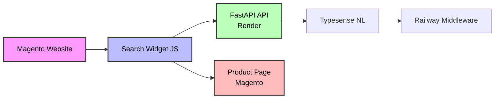
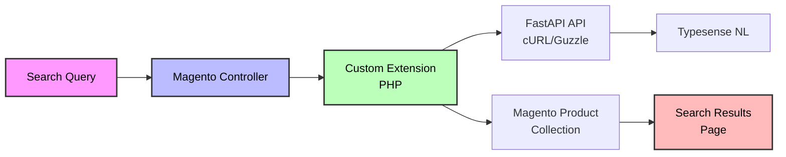

# Magento 2 Integration Guide

## Overview

This guide explains how to integrate the Mercedes Scientific Natural Language Search system into the existing Magento 2 website at https://www.mercedesscientific.com/.

**This guide covers TWO aspects:**
1. **Data Indexing**: How to index products from your Magento database into Typesense
2. **Search Integration**: How to integrate NL search into your Magento storefront

---

## Part 1: Indexing Products from Magento Database

Before you can use NL search, you need to index your Magento products into Typesense. There are **two indexing options**:

### Option 1: Neon Database Indexer (CURRENT SETUP)

**What it is:** Your products are already synced to a Neon PostgreSQL database, and the indexer reads from there.

**Pros:**
- ✅ Already working (34k+ products indexed)
- ✅ Simpler query structure
- ✅ Faster indexing

**Cons:**
- ⚠️ Requires maintaining Neon database sync with Magento
- ⚠️ Additional infrastructure dependency

### Option 2: Direct Magento Database Indexer ⭐ (NEW)

**What it is:** Connect directly to your Magento MySQL database and index products from there.

**Pros:**
- ✅ No intermediate database needed
- ✅ Single source of truth (Magento DB)
- ✅ Can schedule automatic re-indexing

**Cons:**
- ⚠️ More complex (Magento uses EAV model)
- ⚠️ Requires database access credentials
- ⚠️ Slightly slower due to EAV joins

---

### Setup: Magento Database Indexer

#### Step 1: Install MySQL Connector

```bash
pip install mysql-connector-python
```

#### Step 2: Configure Database Connection

Add these environment variables to your `.env` file:

```bash
# Magento Database Configuration
MAGENTO_DB_HOST=your-magento-db-host.com
MAGENTO_DB_PORT=3306
MAGENTO_DB_NAME=magento_database_name
MAGENTO_DB_USER=magento_user
MAGENTO_DB_PASSWORD=your-magento-db-password
```

**Getting database credentials:**

1. **SSH into your Magento server**
2. **Find database credentials** in Magento config:
   ```bash
   cat app/etc/env.php | grep -A 10 "'connection'"
   ```
3. **Use read-only user** (recommended for security):
   ```sql
   CREATE USER 'magento_readonly'@'%' IDENTIFIED BY 'secure_password';
   GRANT SELECT ON magento_database.* TO 'magento_readonly'@'%';
   FLUSH PRIVILEGES;
   ```

#### Step 3: Run Magento Indexer

**Test with limited products first:**

```bash
python3 -c "
from src.indexer_magento import MagentoProductIndexer
indexer = MagentoProductIndexer()
indexer.run(max_products=100)
"
```

**Full indexing (all products):**

```bash
python src/indexer_magento.py
```

**Expected output:**
```
============================================================
Mercedes Scientific Product Indexer (Magento → Typesense)
============================================================
Mode: Full indexing (all enabled products from Magento)
Source: Magento 2 MySQL Database
Embedding Model: text-embedding-3-small
Collection: mercedes_products
============================================================

Connecting to Magento database...
Host: your-host:3306
Database: magento_db

⏳ Discovering Magento attribute IDs...
✓ Found 17 product attributes

⏳ Fetching products from Magento database...
Fetching all products
✓ Query executed in 2.3s

⏳ Transforming products...

============================================================
✓ Total products fetched: 34,607
============================================================

Indexing 34,607 products to Typesense...
Batches: 347 (batch size: 100)
Note: Embeddings are generated automatically during indexing

  Batch 1/347: Indexed 100/100 products (Total: 100/34,607 | 0.3% complete)
  Batch 2/347: Indexed 100/100 products (Total: 200/34,607 | 0.6% complete)
  ...
```

**Indexing time:** ~35-45 minutes for 34k products

#### Step 4: Schedule Automatic Re-indexing

**Option A: Cron job (daily at 2 AM)**

```bash
crontab -e

# Add this line:
0 2 * * * cd /path/to/project && /path/to/python3 src/indexer_magento.py >> /var/log/magento-indexer.log 2>&1
```

**Option B: Magento Observer (real-time)**

Create a Magento extension that triggers re-indexing when products are updated:

```php
// Mercedes_NLSearch/Observer/ProductSaveAfter.php
namespace Mercedes\NLSearch\Observer;

use Magento\Framework\Event\ObserverInterface;

class ProductSaveAfter implements ObserverInterface
{
    public function execute(\Magento\Framework\Event\Observer $observer)
    {
        $product = $observer->getProduct();

        // Trigger re-index for this product
        exec("python /path/to/src/indexer_magento.py --product-id=" . $product->getId());
    }
}
```

---

### How the Magento Indexer Works

**Magento's EAV Model:**

Magento uses an **Entity-Attribute-Value (EAV)** database structure where product data is spread across multiple tables:

- `catalog_product_entity` - Main product table (SKU, timestamps)
- `catalog_product_entity_varchar` - Text attributes (name, brand, size, etc.)
- `catalog_product_entity_int` - Integer attributes (status, visibility)
- `catalog_product_entity_decimal` - Decimal attributes (price, weight)
- `catalog_product_entity_text` - Long text attributes (description)
- `cataloginventory_stock_item` - Stock status and quantity

**The indexer:**
1. Queries `eav_attribute` to find attribute IDs
2. Joins all attribute tables to build complete product data
3. Fetches only enabled products (status=1)
4. Transforms to Typesense schema
5. Indexes with automatic embedding generation

**Schema mapping:**
```
Magento Field          → Typesense Field
------------------------------------------------
entity_id              → product_id
sku                    → sku, sku_normalized
name                   → name, name_normalized
url_key                → url_key
price                  → price
special_price          → special_price
description            → description (HTML stripped)
is_in_stock            → stock_status
custom attributes      → brand, size, color, etc.
created_at/updated_at  → temporal fields (Unix timestamps)
```

---

## Part 2: Search Integration

Now that your products are indexed, you can integrate the NL search into your Magento storefront.

## Integration Options

### Option A: JavaScript Widget Overlay ⭐ (RECOMMENDED - Quick Start)

**Timeline:** 1-2 days
**Complexity:** Low
**Best for:** Fast deployment, testing, proof of concept

#### How It Works

1. Load a lightweight JavaScript widget on Magento pages
2. Widget intercepts search box interactions
3. Calls FastAPI backend (Render) for results
4. Displays results in overlay/modal
5. Clicking result redirects to Magento product page

#### Architecture



#### Implementation

**Step 1: Create Search Widget**

```javascript
// magento-widget/search-widget.js
class MercedesNLSearch {
    constructor(config) {
        this.apiUrl = config.apiUrl;
        this.magentoBaseUrl = config.magentoBaseUrl;
        this.init();
    }

    init() {
        // Find Magento search box
        const searchBox = document.querySelector('#search');
        if (!searchBox) return;

        // Add event listeners
        searchBox.addEventListener('input', this.debounce(this.handleSearch.bind(this), 300));
        searchBox.addEventListener('keydown', (e) => {
            if (e.key === 'Enter') {
                e.preventDefault();
                this.performFullSearch(searchBox.value);
            }
        });
    }

    async handleSearch(event) {
        const query = event.target.value;
        if (query.length < 3) return;

        try {
            const response = await fetch(`${this.apiUrl}/api/search`, {
                method: 'POST',
                headers: { 'Content-Type': 'application/json' },
                body: JSON.stringify({ query, max_results: 8 })
            });

            const data = await response.json();
            this.showInstantResults(data.results);
        } catch (error) {
            console.error('Search error:', error);
        }
    }

    showInstantResults(products) {
        // Create/update results overlay
        let overlay = document.getElementById('nl-search-overlay');
        if (!overlay) {
            overlay = document.createElement('div');
            overlay.id = 'nl-search-overlay';
            overlay.className = 'nl-search-overlay';
            document.body.appendChild(overlay);
        }

        // Render results
        overlay.innerHTML = `
            <div class="nl-search-results">
                <div class="results-header">
                    <h3>Search Results</h3>
                    <button onclick="this.closest('.nl-search-overlay').remove()">×</button>
                </div>
                <div class="results-grid">
                    ${products.map(p => `
                        <a href="${this.magentoBaseUrl}/${p.url_key}.html" class="result-item">
                            
                            <div class="result-info">
                                <h4>${p.name}</h4>
                                <p class="sku">SKU: ${p.sku}</p>
                                <p class="price">$${p.price?.toFixed(2) || 'N/A'}</p>
                            </div>
                        </a>
                    `).join('')}
                </div>
            </div>
        `;

        overlay.style.display = 'block';
    }

    debounce(func, wait) {
        let timeout;
        return function executedFunction(...args) {
            clearTimeout(timeout);
            timeout = setTimeout(() => func.apply(this, args), wait);
        };
    }
}

// Initialize when DOM is ready
document.addEventListener('DOMContentLoaded', () => {
    new MercedesNLSearch({
        apiUrl: 'https://mercedes-search-api.onrender.com',
        magentoBaseUrl: 'https://www.mercedesscientific.com'
    });
});
```

**Step 2: Add Widget Styles**

```css
/* magento-widget/search-widget.css */
.nl-search-overlay {
    position: fixed;
    top: 0;
    left: 0;
    right: 0;
    bottom: 0;
    background: rgba(0, 0, 0, 0.7);
    z-index: 10000;
    display: none;
    padding: 60px 20px;
    overflow-y: auto;
}

.nl-search-results {
    max-width: 1200px;
    margin: 0 auto;
    background: white;
    border-radius: 8px;
    padding: 24px;
}

.results-header {
    display: flex;
    justify-content: space-between;
    align-items: center;
    margin-bottom: 20px;
    border-bottom: 2px solid #e0e0e0;
    padding-bottom: 12px;
}

.results-header h3 {
    margin: 0;
    font-size: 24px;
}

.results-header button {
    background: none;
    border: none;
    font-size: 32px;
    cursor: pointer;
    color: #666;
}

.results-grid {
    display: grid;
    grid-template-columns: repeat(auto-fill, minmax(250px, 1fr));
    gap: 20px;
}

.result-item {
    border: 1px solid #e0e0e0;
    border-radius: 8px;
    padding: 16px;
    text-decoration: none;
    color: inherit;
    transition: box-shadow 0.2s;
}

.result-item:hover {
    box-shadow: 0 4px 12px rgba(0, 0, 0, 0.15);
}

.result-item img {
    width: 100%;
    height: 200px;
    object-fit: contain;
    margin-bottom: 12px;
}

.result-info h4 {
    font-size: 16px;
    margin: 0 0 8px 0;
    font-weight: 600;
}

.result-info .sku {
    color: #666;
    font-size: 14px;
    margin: 4px 0;
}

.result-info .price {
    color: #c00;
    font-size: 18px;
    font-weight: bold;
    margin: 8px 0 0 0;
}
```

**Step 3: Add to Magento Theme**

Edit your theme's template: `app/design/frontend/YourVendor/YourTheme/Magento_Theme/templates/html/header.phtml`

```xml
<!-- Add before </head> -->
<link rel="stylesheet" href="<?= $block->getViewFileUrl('Mercedes_NLSearch::css/search-widget.css') ?>" />
<script src="<?= $block->getViewFileUrl('Mercedes_NLSearch::js/search-widget.js') ?>" defer></script>
```

**Step 4: Deploy**

```bash
# In Magento root
php bin/magento setup:static-content:deploy
php bin/magento cache:flush
```

#### Pros & Cons

✅ **Pros:**
- Quick implementation (1-2 days)
- No PHP/Magento expertise required
- Easy to update independently
- Works with any Magento theme
- Can deploy/test without affecting existing search

❌ **Cons:**
- Requires JavaScript enabled
- Not ideal for SEO (client-side rendering)
- Results page URL won't change
- Slightly different UX than native Magento

---

### Option B: Magento 2 Extension (Full Integration)

**Timeline:** 1-2 weeks
**Complexity:** High
**Best for:** Production deployment, SEO, native experience

#### How It Works

1. Create custom Magento extension
2. Extension hooks into catalog search layer
3. PHP code calls FastAPI API
4. Results integrate with Magento product collection
5. Uses native Magento templates

#### Architecture



#### Implementation

**Step 1: Create Extension Structure**

```bash
mkdir -p app/code/Mercedes/NLSearch
cd app/code/Mercedes/NLSearch
```

**File: registration.php**

```php
<?php
\Magento\Framework\Component\ComponentRegistrar::register(
    \Magento\Framework\Component\ComponentRegistrar::MODULE,
    'Mercedes_NLSearch',
    __DIR__
);
```

**File: etc/module.xml**

```xml
<?xml version="1.0"?>
<config xmlns:xsi="http://www.w3.org/2001/XMLSchema-instance"
        xsi:noNamespaceSchemaLocation="urn:magento:framework:Module/etc/module.xsd">
    <module name="Mercedes_NLSearch" setup_version="1.0.0">
        <sequence>
            <module name="Magento_CatalogSearch"/>
        </sequence>
    </module>
</config>
```

**File: etc/di.xml**

```xml
<?xml version="1.0"?>
<config xmlns:xsi="http://www.w3.org/2001/XMLSchema-instance"
        xsi:noNamespaceSchemaLocation="urn:magento:framework:ObjectManager/etc/config.xsd">
    <!-- Override catalog search -->
    <preference for="Magento\CatalogSearch\Model\ResourceModel\Fulltext\Collection"
                type="Mercedes\NLSearch\Model\ResourceModel\Fulltext\Collection"/>
</config>
```

**File: Model/ApiClient.php**

```php
<?php
namespace Mercedes\NLSearch\Model;

use Magento\Framework\HTTP\Client\Curl;
use Magento\Framework\Serialize\Serializer\Json;

class ApiClient
{
    private $curl;
    private $json;
    private $apiUrl = 'https://mercedes-search-api.onrender.com/api/search';

    public function __construct(Curl $curl, Json $json)
    {
        $this->curl = $curl;
        $this->json = $json;
    }

    public function search($query, $maxResults = 20)
    {
        try {
            $this->curl->addHeader('Content-Type', 'application/json');
            $this->curl->post($this->apiUrl, $this->json->serialize([
                'query' => $query,
                'max_results' => $maxResults
            ]));

            $response = $this->curl->getBody();
            $data = $this->json->unserialize($response);

            return $data['results'] ?? [];
        } catch (\Exception $e) {
            // Log error
            return [];
        }
    }
}
```

**File: Model/ResourceModel/Fulltext/Collection.php**

```php
<?php
namespace Mercedes\NLSearch\Model\ResourceModel\Fulltext;

use Magento\CatalogSearch\Model\ResourceModel\Fulltext\Collection as MagentoCollection;
use Mercedes\NLSearch\Model\ApiClient;

class Collection extends MagentoCollection
{
    private $apiClient;

    public function __construct(
        // ... parent dependencies
        ApiClient $apiClient
    ) {
        parent::__construct(/* ... pass parent deps */);
        $this->apiClient = $apiClient;
    }

    protected function _renderFiltersBefore()
    {
        // Get search query
        $query = $this->queryFactory->get()->getQueryText();

        if ($query) {
            // Call NL search API
            $results = $this->apiClient->search($query, $this->getPageSize());

            // Extract product IDs
            $productIds = array_map(function($result) {
                return $result['product_id'];
            }, $results);

            if (!empty($productIds)) {
                // Filter collection by API results
                $this->addFieldToFilter('entity_id', ['in' => $productIds]);

                // Maintain order from API
                $this->getSelect()->order(
                    new \Zend_Db_Expr('FIELD(e.entity_id, ' . implode(',', $productIds) . ')')
                );
            } else {
                // No results - return empty collection
                $this->addFieldToFilter('entity_id', ['eq' => 0]);
            }
        }

        parent::_renderFiltersBefore();
    }
}
```

**Step 2: Enable Extension**

```bash
php bin/magento module:enable Mercedes_NLSearch
php bin/magento setup:upgrade
php bin/magento setup:di:compile
php bin/magento cache:flush
```

**Step 3: Test**

Go to: `https://www.mercedesscientific.com/catalogsearch/result/?q=nitrile+gloves`

Should now use NL search API!

#### Pros & Cons

✅ **Pros:**
- Native Magento experience
- SEO-friendly (server-side)
- Works without JavaScript
- Integrates with Magento UI/templates
- Professional solution

❌ **Cons:**
- Requires Magento expertise
- 1-2 weeks development time
- Harder to update independently
- Need to test thoroughly with Magento upgrades

---

### Option C: Hybrid Approach ⭐ (RECOMMENDED - Production)

**Timeline:** 2-3 weeks
**Complexity:** Medium
**Best for:** Production deployment with optimal UX

#### How It Works

Combine both approaches:
- **JavaScript widget** for instant search & autocomplete
- **Magento extension** for full search results page
- Best of both worlds!

#### Implementation

1. Implement JavaScript widget (Option A) for **autocomplete**
2. Implement Magento extension (Option B) for **results page**
3. Widget shows instant results while typing
4. Pressing Enter → full results page via Magento extension

#### User Flow

```
User types "nitrile gloves"
└─> Widget shows instant results (overlay)
    ├─> Click result → Product page
    └─> Press Enter → Full results page (SEO-friendly)
```

#### Pros & Cons

✅ **Pros:**
- Best user experience
- SEO-friendly results page
- Instant feedback while typing
- Professional solution

❌ **Cons:**
- Most complex (combines both approaches)
- Longest development time
- Need both JavaScript and PHP expertise

---

## Technical Requirements

### 1. Product URL Mapping

Your Typesense products have `url_key` field. Map to Magento URLs:

```javascript
// JavaScript
const productUrl = `https://www.mercedesscientific.com/${product.url_key}.html`;
```

```php
// PHP
$productUrl = $this->storeManager->getStore()->getBaseUrl() . $product->getUrlKey() . '.html';
```

**Example:**
- Product: `url_key="tanner-scientific-blutouch-nitrile-gloves"`
- URL: `https://www.mercedesscientific.com/tanner-scientific-blutouch-nitrile-gloves.html`

### 2. CORS Configuration

Update FastAPI backend (src/app.py) to allow Magento domain:

```python
app.add_middleware(
    CORSMiddleware,
    allow_origins=[
        "https://www.mercedesscientific.com",
        "https://mercedes-nl-search.vercel.app",  # Demo site
        "http://localhost:*"  # Development
    ],
    allow_credentials=True,
    allow_methods=["*"],
    allow_headers=["*"],
)
```

Deploy this change to Render before testing!

### 3. Authentication & Session

**For JavaScript Widget:**
- Search API is public (no auth needed)
- User session stays in Magento
- Clicking result → Magento product page (session maintained)

**For Magento Extension:**
- Backend calls API server-side
- No CORS/cross-domain issues
- User session completely within Magento

### 4. Price & Inventory Sync

**Critical:** Your Typesense index may become stale!

#### Option 1: Real-time Sync (Webhook)

```php
// Mercedes_NLSearch/Observer/ProductSaveAfter.php
namespace Mercedes\NLSearch\Observer;

use Magento\Framework\Event\ObserverInterface;
use Mercedes\NLSearch\Model\ApiClient;

class ProductSaveAfter implements ObserverInterface
{
    private $apiClient;

    public function __construct(ApiClient $apiClient)
    {
        $this->apiClient = $apiClient;
    }

    public function execute(\Magento\Framework\Event\Observer $observer)
    {
        $product = $observer->getProduct();

        // Trigger re-index for this product
        $this->apiClient->updateProduct($product->getId(), [
            'price' => $product->getPrice(),
            'special_price' => $product->getSpecialPrice(),
            'stock_status' => $product->getStockStatus(),
            'qty' => $product->getQty()
        ]);
    }
}
```

**Note:** You'll need to add an update endpoint to your FastAPI backend.

#### Option 2: Scheduled Sync (Cron)

```bash
# Run full re-index daily at 2 AM
0 2 * * * cd /path/to/project && /path/to/python src/indexer_neon.py
```

**Time:** ~35-45 minutes for full 34k catalog

#### Option 3: Hybrid Display (Best UX)

Display Typesense search results, but fetch real-time price/stock from Magento API:

```javascript
async showResults(products) {
    // Get real-time prices from Magento
    const skus = products.map(p => p.sku);
    const priceData = await fetch('/rest/V1/products/prices', {
        method: 'POST',
        body: JSON.stringify({ skus })
    });

    // Merge with search results
    const enrichedProducts = products.map(p => ({
        ...p,
        realtime_price: priceData[p.sku].price,
        realtime_stock: priceData[p.sku].stock_status
    }));

    this.render(enrichedProducts);
}
```

---

## Deployment Steps

### Phase 1: Setup (Week 1)

- [ ] Update CORS in FastAPI backend (add Magento domain)
- [ ] Deploy CORS changes to Render
- [ ] Test API accessibility from Magento domain
- [ ] Verify product URL structure in Magento

### Phase 2: Development (Week 2-3)

**Option A (Widget):**
- [ ] Create search widget JavaScript
- [ ] Create widget CSS
- [ ] Add to Magento theme
- [ ] Test on staging

**Option B (Extension):**
- [ ] Create Magento extension structure
- [ ] Implement API client
- [ ] Override search collection
- [ ] Test on staging

**Option C (Hybrid):**
- [ ] Implement both widget + extension
- [ ] Test interaction between both
- [ ] Test on staging

### Phase 3: Testing (Week 3-4)

- [ ] Test search functionality
- [ ] Verify product links work
- [ ] Test on mobile devices
- [ ] Performance testing
- [ ] Cross-browser testing
- [ ] SEO validation (for extension)

### Phase 4: Production (Week 4)

- [ ] Deploy to production
- [ ] Monitor for errors
- [ ] Gather user feedback
- [ ] Setup monitoring/analytics

---

## Recommendation

**For Quick Start (1-2 weeks):**
→ **Option A: JavaScript Widget**
- Fast implementation
- Easy to test/iterate
- Minimal risk to existing site

**For Production (2-4 weeks):**
→ **Option C: Hybrid Approach**
- Best user experience
- SEO-friendly
- Professional solution
- Worth the extra development time

---

## Cost Considerations

### API Costs (per 1000 searches)
- OpenAI (GPT-4o-mini + embeddings): ~$0.50
- Typesense Cloud: Included in plan
- Render hosting: Included in plan

**Total:** ~$0.50 per 1000 searches (very affordable!)

### Development Costs
- **Option A:** 16-24 hours (frontend dev)
- **Option B:** 40-60 hours (Magento dev)
- **Option C:** 60-80 hours (both)

---

## Support & Maintenance

### Monitoring

Add analytics to track:
- Search queries
- Click-through rates
- Failed searches (0 results)
- API response times

### Maintenance

- **Monthly:** Review failed searches, add synonyms
- **Quarterly:** Re-index full catalog
- **Annually:** Update NL model prompt if needed

---

## Questions to Answer Before Starting

1. **Timeline:** How quickly do you need this deployed?
   - 1-2 weeks → Option A (Widget)
   - 3-4 weeks → Option C (Hybrid)

2. **Resources:** What expertise do you have available?
   - Frontend only → Option A
   - Magento expertise → Option B or C

3. **SEO:** Is SEO critical for search results pages?
   - Yes → Option B or C (server-side)
   - No → Option A (client-side)

4. **Budget:** What's your development budget?
   - Limited → Option A
   - Moderate → Option B
   - Flexible → Option C

5. **Data Sync:** How will you keep Typesense data fresh?
   - Real-time webhooks
   - Daily cron job
   - Hybrid display

---

## Next Steps

1. **Decide on integration approach** (A, B, or C)
2. **Update CORS configuration** in FastAPI
3. **Start development** based on chosen option
4. **Test on staging** environment
5. **Deploy to production**

Let me know which approach you'd like to pursue, and I can help with the implementation!
