# RAG Dual LLM Approach Documentation

**Version**: 2.2.0
**Date**: October 17, 2025
**Status**: ✅ Production-Ready

## Overview

The Mercedes Scientific Natural Language Search system now uses a **dual LLM approach** that combines:

1. **LLM Call 1**: Natural language query translation via Typesense NL (filter extraction)
2. **LLM Call 2**: RAG-based category classification (intelligent category detection)

This approach achieves **84.6% accuracy** on our test dataset while providing transparent reasoning for search decisions.

## Architecture

```mermaid
flowchart TB
    A["👤 User Query<br/>nitrile gloves, powder-free, in stock, under $30"]
    B["🤖 LLM Call 1: NL Query Translation<br/>Typesense NL Model<br/>Extracts: price, stock, brand, size, color"]
    C["📊 Extracted Parameters<br/>q: nitrile glove powder-free<br/>filter_by: stock_status:=IN_STOCK && price:<30"]
    D["🔍 Retrieval Search<br/>20 products with NL filters<br/>NO category filter yet"]
    E["📦 Context Extraction<br/>Group by categories<br/>Sample products per category"]
    F["🤖 LLM Call 2: RAG Classification<br/>GPT-4o-mini analyzes context<br/>Detects category + confidence"]
    G["✅ Category Detected<br/>Products/Gloves & Apparel/Gloves<br/>Confidence: 0.85 ≥ 0.75"]
    H["🎯 Final Search<br/>Combined Filters:<br/>categories:=Gloves && stock_status:=IN_STOCK && price:<30"]
    I["✨ Results<br/>3 nitrile gloves, powder-free, in stock, under $30"]

    A --> B
    B --> C
    C --> D
    D --> E
    E --> F
    F --> G
    G --> H
    H --> I

    style A fill:#e3f2fd,stroke:#1976d2,stroke-width:2px,color:#000
    style B fill:#fff3e0,stroke:#f57c00,stroke-width:2px,color:#000
    style C fill:#f5f5f5,stroke:#616161,stroke-width:2px,color:#000
    style D fill:#e8f5e9,stroke:#388e3c,stroke-width:2px,color:#000
    style E fill:#fff9c4,stroke:#f9a825,stroke-width:2px,color:#000
    style F fill:#fce4ec,stroke:#c2185b,stroke-width:2px,color:#000
    style G fill:#e1bee7,stroke:#7b1fa2,stroke-width:2px,color:#000
    style H fill:#c8e6c9,stroke:#388e3c,stroke-width:2px,color:#000
    style I fill:#b2ebf2,stroke:#0097a7,stroke-width:3px,color:#000
```



## Key Components

### 1. NL Model (LLM Call 1)

**File**: `src/setup_nl_model.py`
**Model**: GPT-4o-mini-2024-07-18 (via Typesense)
**Model ID**: UUID-based (e.g., `9bb52abc-8bf8-4536-80de-8231e77fab14`)

**Purpose**: Extract non-category filters from natural language queries

**Extracts**:
- ✅ Price filters (`price:<30`, `price:[20..50]`)
- ✅ Stock filters (`stock_status:=IN_STOCK`)
- ✅ Brand filters (`brand:=Mercedes Scientific`)
- ✅ Size filters (`size:=Large`)
- ✅ Color filters (`color:=Blue`)
- ✅ Sort preferences (`price:asc`, `created_at:desc`)
- ❌ **Does NOT extract category filters** (RAG handles this)

**System Prompt**: RAG-optimized to avoid category extraction, allowing RAG to intelligently detect categories based on context.

### 2. RAG Search Engine (LLM Call 2)

**File**: `src/search_rag.py`
**Class**: `RAGNaturalLanguageSearch`
**Model**: GPT-4o-mini-2024-07-18 (direct OpenAI API)

**Purpose**: Intelligently detect product categories based on retrieved context

**Workflow**:
1. **Retrieval** (`_retrieve_semantic_results`): Get top 20 products with NL filters
2. **Context Extraction** (`_extract_category_context`): Group by categories, sample products
3. **Classification** (`_classify_category_with_llm`): LLM analyzes context, returns category + confidence
4. **Filter Application** (`_search_with_category_filter`): If confident, apply category filter

**Conservative Rules**:
- Returns `null` for single-word attributes ("clear", "large", "sterile")
- Returns `null` for brand-only queries ("Mercedes Scientific")
- Returns `null` for highly ambiguous queries ("filters")
- Default confidence threshold: 0.75

### 3. Flask API Integration

**File**: `src/app.py`
**Endpoint**: `POST /api/search`

**Request**:
```json
{
  "query": "nitrile gloves, powder-free, in stock, under $30",
  "max_results": 20,
  "debug": true,  // Auto-enabled for localhost
  "confidence_threshold": 0.75
}
```

**Response**:
```json
{
  "results": [...],
  "total": 3,
  "query_time_ms": 4157,
  "detected_category": "Products/Gloves & Apparel/Gloves",
  "category_confidence": 0.85,
  "category_applied": true,
  "confidence_threshold": 0.75,
  "typesense_query": {
    "nl_extracted_query": "nitrile glove powder-free",
    "nl_extracted_filters": "stock_status:=IN_STOCK && price:<30",
    "llm_reasoning": "The query specifies 'nitrile gloves'..."
  }
}
```

### 4. Frontend Display

**File**: `frontend-next/app/page.tsx`

**Features**:
- Displays complete parsed query with category + NL filters
- Auto-enables debug mode for localhost
- Shows combined filter: `categories:=Gloves && stock_status:=IN_STOCK && price:<30`

**Example Display**:
```
{"q":"nitrile glove powder-free", "filter_by":"categories:=`Products/Gloves & Apparel/Gloves` && stock_status:=IN_STOCK && price:<30"}
```

## Performance

### Query Time
- **LLM Call 1 (NL)**: ~1,500-2,000ms
- **LLM Call 2 (RAG)**: ~2,000-3,500ms
- **Total**: ~3,500-4,500ms (8-10x slower than single LLM)

### Cost
- **Per 1,000 queries**: ~$20 (2x cost of single LLM approach)
- **Trade-off**: Better accuracy on edge cases, transparent reasoning

### Accuracy
- **84.6%** on 26-test dataset
- **3 improvements** over baseline (lab coats, autoclave bags, semantic matches)
- **1 remaining issue**: Retrieval problem (fixable)

## Setup Instructions

### 1. Register NL Model

```bash
# This creates a RAG-optimized NL model that doesn't extract categories
python src/setup_nl_model.py
```

**Important**: The model ID will be a UUID. The system automatically uses the correct UUID.

### 2. Start API Server

```bash
python src/app.py
```

The API now uses `RAGNaturalLanguageSearch` instead of `NaturalLanguageSearch`.

### 3. Test

```bash
# Test with debug mode
curl -X POST http://localhost:5001/api/search \
  -H "Content-Type: application/json" \
  -d '{"query": "nitrile gloves, powder-free, in stock, under $30", "debug": true}'
```

## Debug Mode

### Server-Side Logs (when `debug=true`)

```
=== RAG Step 1: NL Search + Retrieval ===
Retrieved 20 results for context
Extracted filters: stock_status:=IN_STOCK && price:<30
Extracted sort: default

=== RAG Step 3: LLM Classification ===
LLM Response Time: 2390.13ms
Category: Products/Gloves & Apparel/Gloves
Confidence: 0.85
Reasoning: The query specifies 'nitrile gloves' which is a clear product type...

=== RAG Step 4: Filtered Search ===
Query text: 'nitrile glove powder-free'
Category filter: 'Products/Gloves & Apparel/Gloves'
Combined filter: 'categories:=`Products/Gloves & Apparel/Gloves` && stock_status:=IN_STOCK && price:<30'
Results: 3
```

### Frontend Auto-Debug

When running on `localhost` or `127.0.0.1`, debug mode is automatically enabled!

## Implementation Details

### Model ID Resolution

**Problem**: Typesense assigns UUID-based model IDs, not the string IDs we provide.

**Solution**:
- `setup_nl_model.py` creates model
- `search_rag.py` uses the actual UUID: `9bb52abc-8bf8-4536-80de-8231e77fab14`

### Category Filter Deduplication

**Problem**: Both NL model and RAG might detect categories, causing duplicates.

**Solution**: RAG removes category filters from NL extraction before combining:

```python
# Remove category from NL filters
if nl_filter and "categories:=" in nl_filter:
    nl_filter = self._remove_category_filter(nl_filter)

# Combine: RAG category + NL filters (price, stock, etc.)
combined_filter = f"{category_filter} && {nl_filter}"
```

### Conservative Prompt Engineering

The RAG model uses explicit rules to avoid false positives:

```python
# Returns null for:
- Single attributes: "clear", "large", "sterile"
- Brand-only: "Mercedes Scientific", "Ansell"
- Ambiguous types: "filters" (water/air/syringe?)
```

## Testing

### Test Suite

**File**: `tests/test_category_classification.py`
**Test Cases**: 26 diverse queries
**Coverage**: Exact matches, generic queries, ambiguous queries, edge cases

```bash
# Run all tests
./venv/bin/pytest tests/test_category_classification.py -v

# Run RAG-specific tests
./venv/bin/pytest tests/test_category_classification.py -v -k "rag_approach"

# Run comparison tests (shows improvements)
./venv/bin/pytest tests/test_category_classification.py -v -k "comparison"
```

### Evaluation Results

See:
- `tests/EVALUATION_RESULTS_FINAL.md` - Detailed analysis
- `tests/FINAL_SUMMARY.md` - Executive summary

## Troubleshooting

### Issue: Query not being translated

**Symptom**: Frontend shows `{"q":"raw query"}` without filters

**Cause**: Model ID mismatch - using string ID instead of UUID

**Fix**: Check `search_rag.py` uses correct UUID:
```python
self.nl_model_id = "9bb52abc-8bf8-4536-80de-8231e77fab14"  # Use UUID
```

### Issue: Category not shown in frontend

**Symptom**: Filter missing category in UI

**Cause**: Frontend not combining RAG category with NL filters

**Fix**: Already fixed in `frontend-next/app/page.tsx` (lines 223-234)

### Issue: Debug logs not showing

**Symptom**: No server-side debug output

**Cause**: Debug mode not enabled

**Fix**:
- Frontend auto-enables for localhost
- Or manually: `{"query": "...", "debug": true}`

## Future Improvements

### Short Term
- [ ] Increase retrieval_count from 20 → 30 for better context
- [ ] Fix remaining retrieval issue ("Mercedes Scientific nitrile gloves size medium")
- [ ] Add caching for frequent queries

### Medium Term
- [ ] Hybrid retrieval (text + semantic embeddings)
- [ ] A/B testing RAG vs baseline
- [ ] Query analytics dashboard

### Long Term
- [ ] Multi-turn conversational search
- [ ] Personalized category preferences
- [ ] Alternative embedding providers

## Migration from Old Approach

### Before (Single LLM)
```python
from src.search import NaturalLanguageSearch
search_engine = NaturalLanguageSearch()
```

### After (Dual LLM RAG)
```python
from src.search_rag import RAGNaturalLanguageSearch
search_engine = RAGNaturalLanguageSearch()
```

**No breaking changes** - API response structure remains compatible!

## References

- **Implementation**: `src/search_rag.py`
- **Setup**: `src/setup_nl_model.py`
- **Tests**: `tests/test_category_classification.py`
- **Test Data**: `tests/category_test_cases.py`
- **Evaluation**: `tests/EVALUATION_RESULTS_FINAL.md`
- **Summary**: `tests/FINAL_SUMMARY.md`

---

**Last Updated**: October 17, 2025
**Accuracy**: 84.6% (22/26 test cases)
**Status**: ✅ Production-Ready
