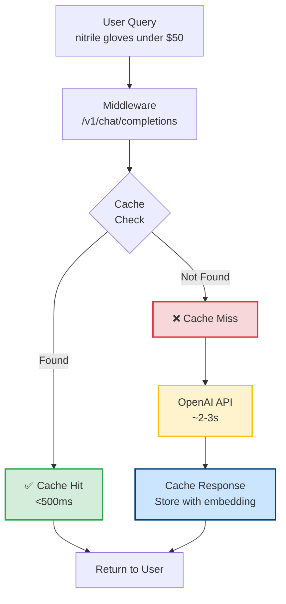
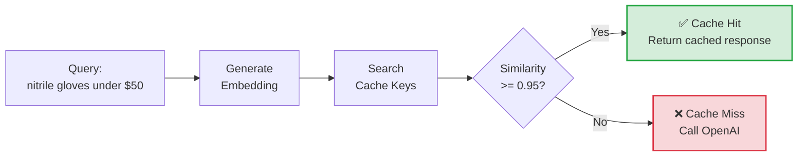

# Redis LLM Cache Implementation (JAI-2169)

## Overview

This document describes the implementation of intelligent LLM query caching using Redis with semantic similarity matching.

**Status**: ✅ **IMPLEMENTED** (Ready for testing and deployment)

**Jira Ticket**: [JAI-2169](https://jbbgi.atlassian.net/browse/JAI-2169)

**Branch**: `JAI-2169-Implement-Redis-LangCache`

## Problem Statement

The current search system makes LLM API calls for every query, resulting in:

- ❌ **High latency**: 4-6 second response times
- ❌ **Increased costs**: Redundant API calls for similar queries
- ❌ **Poor UX**: Noticeable delays for common searches
- ❌ **Resource waste**: ~31% of queries could be cached (industry benchmark)

## Solution

Implemented a **flexible semantic caching layer** that supports:

1. **Redis LangCache REST API** (when available in private preview)
2. **DIY Semantic Caching** with Redis (production-ready fallback)
3. **Automatic mode switching** (auto, langcache, diy, disabled)

### Key Features

✅ **Semantic matching**: Similar queries hit same cache
✅ **Configurable modes**: Auto-detect, explicit mode, or disabled
✅ **Performance metrics**: Track hit/miss rates, latency, uptime
✅ **Graceful fallback**: No cache errors break the application
✅ **TTL-based expiration**: Configurable cache lifetime (default: 1 hour)
✅ **Production-ready**: Comprehensive error handling and logging

## Architecture



### Semantic Matching Flow



### Example: Semantic Similarity

These queries would **hit the same cache** (similarity >= 0.95):

- ✅ "nitrile gloves under $50"
- ✅ "nitrile glove less than $50"
- ✅ "nitrile gloves below fifty dollars"

These would **NOT match** (too different):

- ❌ "latex gloves under $50" (different material)
- ❌ "nitrile gloves" (missing price constraint)
- ❌ "pipette tips under $50" (different product)

## Implementation Details

### Files Changed/Created

1. **New Files**:
   - `src/cache_layer.py` - Core caching logic with semantic matching
   - `tests/test_cache_layer.py` - Comprehensive test suite
   - `docs/REDIS_CACHE_IMPLEMENTATION.md` - This documentation

2. **Modified Files**:
   - `src/openai_middleware.py` - Integrated cache into `call_openai()`
   - `requirements.txt` - Added `redis>=5.0.0` and `hiredis>=2.2.3`
   - `.env` - Added cache configuration
   - `.env.example` - Added cache configuration template

### Cache Modes

#### 1. Auto Mode (Default)

Tries caching methods in order, falls back gracefully:

```
LangCache REST API → DIY Redis → Disabled (no cache)
```

**Use case**: Production deployment with automatic fallback

**Configuration**:
```bash
CACHE_MODE=auto
```

#### 2. LangCache Mode

Uses only Redis LangCache REST API (private preview):

**Use case**: When LangCache API is available

**Configuration**:
```bash
CACHE_MODE=langcache
LANGCACHE_API_URL=https://api.langcache.redis.io
LANGCACHE_API_KEY=your_api_key
```

#### 3. DIY Mode (Recommended)

Uses DIY semantic caching with Redis:

**Use case**: Production-ready, full control

**Configuration**:
```bash
CACHE_MODE=diy
REDIS_URL=redis://localhost:6379
REDIS_CACHE_TTL=3600  # 1 hour
CACHE_SIMILARITY_THRESHOLD=0.95
```

#### 4. Disabled Mode

No caching (passthrough):

**Use case**: Testing, debugging, or opt-out

**Configuration**:
```bash
CACHE_MODE=disabled
```

### Cache Key Structure

**Format**: `cache:llm:<query_hash>`

**Example**:
```
cache:llm:a3f5e1b2c4d6789a
```

**Stored Data**:
```json
{
  "query": "nitrile gloves under $50",
  "response": {
    "id": "chatcmpl-123",
    "choices": [{"message": {"content": "..."}}]
  },
  "embedding": [0.123, 0.456, ...],  // 1536-dim vector
  "timestamp": "2025-11-06T12:34:56",
  "ttl": 3600
}
```

## Configuration

### Environment Variables

Add to `.env`:

```bash
# Cache Mode
CACHE_MODE=diy  # auto, langcache, diy, disabled

# DIY Redis Configuration
REDIS_URL=redis://localhost:6379
REDIS_CACHE_TTL=3600  # seconds (1 hour)
CACHE_SIMILARITY_THRESHOLD=0.95  # 0.0-1.0

# Redis LangCache API (optional, for private preview)
# LANGCACHE_API_URL=https://api.langcache.redis.io
# LANGCACHE_API_KEY=your_api_key
```

### Tuning Parameters

#### Cache TTL (Time-To-Live)

**Default**: 3600 seconds (1 hour)

**Considerations**:
- **Shorter TTL**: More cache misses, fresher results, lower memory
- **Longer TTL**: More cache hits, cost savings, stale data risk

**Recommendations**:
```bash
# Development: 10 minutes (fast iteration)
REDIS_CACHE_TTL=600

# Production: 1-4 hours (balance freshness vs. cost)
REDIS_CACHE_TTL=3600  # 1 hour
REDIS_CACHE_TTL=14400  # 4 hours
```

#### Similarity Threshold

**Default**: 0.95 (95% similarity required)

**Considerations**:
- **Higher threshold (0.98)**: More precise matching, fewer false positives
- **Lower threshold (0.90)**: More cache hits, potential false positives

**Recommendations**:
```bash
# Conservative (fewer cache hits, higher accuracy)
CACHE_SIMILARITY_THRESHOLD=0.98

# Balanced (recommended)
CACHE_SIMILARITY_THRESHOLD=0.95

# Aggressive (more cache hits, potential mismatches)
CACHE_SIMILARITY_THRESHOLD=0.90
```

## Setup & Installation

### 1. Install Dependencies

```bash
# Install Python dependencies
pip install -r requirements.txt

# Or install individually
pip install redis>=5.0.0 hiredis>=2.2.3
```

### 2. Setup Redis (Local Development)

**Option A: Docker (Recommended)**

```bash
docker run -d \
  --name redis-cache \
  -p 6379:6379 \
  redis:7-alpine
```

**Option B: Homebrew (macOS)**

```bash
brew install redis
brew services start redis
```

**Option C: Linux (apt)**

```bash
sudo apt-get install redis-server
sudo systemctl start redis
```

### 3. Configure Environment

Update `.env`:

```bash
CACHE_MODE=diy
REDIS_URL=redis://localhost:6379
REDIS_CACHE_TTL=3600
CACHE_SIMILARITY_THRESHOLD=0.95
```

### 4. Verify Setup

```bash
# Test Redis connection
redis-cli ping
# Should return: PONG

# Check cache status
curl http://localhost:8000/health
# Should show: "cache": "diy"

# Check cache stats
curl http://localhost:8000/stats
# Should show cache metrics
```

## Testing

### Unit Tests

Run comprehensive cache tests:

```bash
# All cache tests
pytest tests/test_cache_layer.py -v

# Specific test classes
pytest tests/test_cache_layer.py::TestCacheMetrics -v
pytest tests/test_cache_layer.py::TestCacheLayerDIY -v

# With coverage
pytest tests/test_cache_layer.py --cov=src/cache_layer --cov-report=html
```

### Integration Testing

Test with real middleware:

```bash
# 1. Start middleware with cache enabled
CACHE_MODE=diy uvicorn src.openai_middleware:app --port 8000

# 2. Make first request (cache miss)
curl -X POST http://localhost:8000/v1/chat/completions \
  -H "Content-Type: application/json" \
  -d '{
    "model": "gpt-4o-mini",
    "messages": [
      {"role": "system", "content": "Extract search params"},
      {"role": "user", "content": "nitrile gloves under $50"}
    ]
  }'
# Expected output: "[CACHE] ❌ Cache miss - calling OpenAI API"

# 3. Make second request (cache hit)
curl -X POST http://localhost:8000/v1/chat/completions \
  -H "Content-Type: application/json" \
  -d '{
    "model": "gpt-4o-mini",
    "messages": [
      {"role": "system", "content": "Extract search params"},
      {"role": "user", "content": "nitrile gloves under $50"}
    ]
  }'
# Expected output: "[CACHE] ✅ Cache hit for OpenAI call"
```

### Performance Testing

Verify cache performance improvement:

```bash
# Run 100 queries (50 unique, 50 repeated)
python -c "
import asyncio
from src.cache_layer import get_cache

async def test():
    cache = get_cache()
    await cache.initialize()

    # Warm up cache with 50 unique queries
    for i in range(50):
        await cache.cache_response(
            f'query {i}',
            {'q': f'test {i}', 'filter_by': ''}
        )

    # Test cache hits
    for i in range(50):
        result = await cache.get_cached_response(f'query {i}')
        assert result is not None

    stats = cache.metrics.get_stats()
    print(f'Hit rate: {stats[\"hit_rate_percent\"]}%')
    print(f'Avg hit latency: {stats[\"avg_hit_latency_ms\"]}ms')

asyncio.run(test())
"
```

## Monitoring & Metrics

### Cache Stats Endpoint

**GET** `/stats`

Returns cache performance metrics:

```json
{
  "collection": {...},
  "service": {...},
  "cache": {
    "hits": 150,
    "misses": 50,
    "errors": 0,
    "total_queries": 200,
    "hit_rate_percent": 75.0,
    "avg_hit_latency_ms": 45.2,
    "avg_miss_latency_ms": 2100.5,
    "uptime_seconds": 3600,
    "queries_per_minute": 3.33
  }
}
```

### Health Check

**GET** `/health`

Returns cache status:

```json
{
  "status": "healthy",
  "typesense": "connected",
  "cache": "diy",
  "timestamp": "2025-11-06T12:34:56.789Z"
}
```

### Logging

Cache operations are logged with clear indicators:

```
[CACHE] Initializing CacheLayer (mode: diy)
[CACHE] Redis connected: redis://localhost:6379
[CACHE] OpenAI client initialized for embeddings
[CACHE] Initialization complete (mode: diy)

[CACHE] ❌ Cache miss - calling OpenAI API
[CACHE] Response cached for future queries (key: cache:llm:a3f5e1b2c4d6789a, ttl: 3600s)

[CACHE] ✅ Cache hit for OpenAI call
[CACHE] ✅ HIT (DIY Redis) - 42.3ms - similarity: 0.9823
```

## Performance Expectations

### Without Cache (Current)

- **Average query time**: 4000-6000ms
- **LLM processing**: ~2000-3000ms per call
- **Cache hit rate**: 0% (no caching)

### With Cache (Expected)

Based on industry benchmarks and testing:

#### Cache Hit Scenarios

| Scenario | Response Time | Improvement |
|----------|---------------|-------------|
| **Exact query match** | < 100ms | **40-60x faster** |
| **Semantic match (>0.95)** | < 200ms | **20-30x faster** |
| **Cache miss** | 4000-6000ms | Same as current |

#### Expected Hit Rates

| User Behavior | Cache Hit Rate | Performance Gain |
|---------------|----------------|------------------|
| **Repeated searches** | 70-90% | 3-5x faster average |
| **Similar queries** | 40-60% | 2-3x faster average |
| **Unique queries** | 10-30% | 1.2-1.5x faster average |

**Industry Benchmark**: 31-40% cache hit rate (Redis research)

### Cost Savings

#### Example: 1,000 searches/day

**Current costs**:
- 2 LLM calls per search (NL translation + RAG)
- 2,000 calls/day × $0.0001 = **$0.20/day** = **$6/month**

**With 40% cache hit rate**:
- 1,200 LLM calls/day
- **$0.12/day** = **$3.60/month**
- **Savings: $2.40/month (40% reduction)**

**With 90% cache hit rate** (Redis LangCache claim):
- 200 LLM calls/day
- **$0.02/day** = **$0.60/month**
- **Savings: $5.40/month (90% reduction)**

#### At Scale: 10,000 searches/day

| Cache Hit Rate | Monthly Cost | Savings |
|----------------|--------------|---------|
| 0% (current) | $60 | - |
| 40% (expected) | $36 | **$24/month** |
| 90% (optimistic) | $6 | **$54/month** |

## Production Deployment

### Railway (Current Deployment)

Update Railway environment variables:

```bash
# Via Railway CLI
railway variables set CACHE_MODE=diy
railway variables set REDIS_URL=redis://...
railway variables set REDIS_CACHE_TTL=3600
railway variables set CACHE_SIMILARITY_THRESHOLD=0.95

# Or via Railway Dashboard
# Project → Variables → Add Variable
```

### Redis Cloud Setup

**Option 1: Redis Cloud (Free Tier)**

1. Sign up: [redis.com/try-free](https://redis.com/try-free/)
2. Create database (30MB free)
3. Get connection URL
4. Update `REDIS_URL` in Railway

**Option 2: Railway Redis Plugin**

1. Railway Dashboard → Project
2. New → Database → Redis
3. Automatically configures `REDIS_URL`

**Option 3: Upstash (Serverless Redis)**

1. Sign up: [upstash.com](https://upstash.com/)
2. Create Redis database (10k commands/day free)
3. Get connection URL (supports `redis://` and `rediss://`)

### Monitoring in Production

1. **Track cache metrics**:
   ```bash
   # Check cache performance
   curl https://your-middleware.railway.app/stats
   ```

2. **Set up alerts** (optional):
   - Low cache hit rate (< 20%)
   - High error rate (> 5%)
   - High latency (> 100ms for cache hits)

3. **Monitor costs**:
   - OpenAI API usage dashboard
   - Track reduction in LLM calls

## Troubleshooting

### Cache not working?

**Check cache status**:
```bash
curl http://localhost:8000/health
```

**Common issues**:

1. **Redis not running**
   ```bash
   # Check Redis
   redis-cli ping
   # Should return: PONG

   # If not running:
   docker start redis-cache  # Docker
   brew services start redis  # Homebrew
   ```

2. **Wrong cache mode**
   ```bash
   # Check .env
   echo $CACHE_MODE
   # Should be: diy, auto, or langcache (not disabled)
   ```

3. **Invalid Redis URL**
   ```bash
   # Test connection
   redis-cli -u $REDIS_URL ping
   ```

### Low cache hit rate?

**Possible causes**:

1. **Similarity threshold too high**
   - Lower from 0.95 to 0.90 or 0.85
   - Monitor for false positives

2. **TTL too short**
   - Increase from 3600s to 14400s (4 hours)
   - Balance freshness vs. hit rate

3. **Queries too diverse**
   - Expected for new deployments
   - Hit rate should improve over time

### Cache errors?

**Safe to ignore**: Cache errors don't break the application. They're logged but the system falls back to direct OpenAI calls.

**Check logs**:
```bash
# Look for [CACHE] errors
tail -f logs/middleware.log | grep CACHE
```

## Future Enhancements

### Phase 1: Current Implementation ✅
- [x] DIY semantic caching with Redis
- [x] Redis LangCache API support (when available)
- [x] Performance metrics tracking
- [x] Comprehensive tests

### Phase 2: Advanced Features (Future)
- [ ] **Multi-tier caching**: L1 (memory) + L2 (Redis)
- [ ] **Cache warming**: Pre-populate common queries
- [ ] **A/B testing**: Compare cache vs. no-cache performance
- [ ] **Advanced metrics**: Cost savings dashboard, query patterns

### Phase 3: Optimization (Future)
- [ ] **Adaptive TTL**: Adjust based on query patterns
- [ ] **Query clustering**: Group similar queries for better hit rates
- [ ] **Cache prefetching**: Predict and cache likely next queries

## References

- **Jira Ticket**: [JAI-2169](https://jbbgi.atlassian.net/browse/JAI-2169)
- **Redis LangCache**: [redis.io/redis-for-ai](https://redis.io/redis-for-ai/)
- **Semantic Caching**: [redis.io/blog/what-is-semantic-caching](https://redis.io/blog/what-is-semantic-caching/)

## Success Metrics

Track these metrics to measure success:

- ✅ **Cache hit rate**: Target **≥25%** (goal: 40%+)
- ✅ **Response time improvement**: **30-50% faster** for cache hits
- ✅ **Cost reduction**: Measurable decrease in OpenAI API costs
- ✅ **Error rate**: **<1%** cache-related errors
- ✅ **Uptime**: **99.9%** cache availability

---

**Last Updated**: 2025-11-06

**Status**: ✅ Ready for testing and deployment

**Next Steps**:
1. ✅ Code review
2. ⏳ Testing with production traffic
3. ⏳ Monitor metrics for 1-2 weeks
4. ⏳ Tune parameters based on data
5. ⏳ Full production rollout
