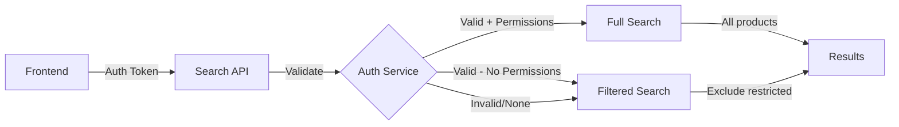

# Restricted Item Access Control Design

## Overview

Implement access control for restricted items (Beckman/Olympus products) that require special account permissions to view and search.

## Business Requirements

### Restricted Items Criteria
- **Beckman Coulter** branded products (brand=Beckman Coulter)
- **Olympus** branded products (brand contains "Olympus")
- Products acquired from third-party distributors (Block)
- Mercedes Scientific is NOT an authorized distributor
- Products sold with disclaimer about unauthorized distribution

### Access Control Rules

**For non-authenticated users OR users without permissions:**
- Restricted items **DO NOT** appear in search results
- Restricted items **ARE NOT** accessible via direct URL
- No indication that these products exist

**For authenticated users with permissions:**
- Restricted items **ARE** visible in search results
- Restricted items **ARE** accessible via product pages
- Disclaimer displayed about unauthorized distribution

## Technical Design

### 1. Restriction Identification

**Option A: Brand-Based Rules (RECOMMENDED - No DB changes)**
```python
RESTRICTED_BRANDS = ["Beckman Coulter", "Olympus"]
RESTRICTED_SKU_PREFIXES = ["BEY", "OSR"]

def is_restricted_product(brand: str, sku: str) -> bool:
    """Check if product is restricted based on brand or SKU."""
    if brand in RESTRICTED_BRANDS:
        return True
    if any(sku.startswith(prefix) for prefix in RESTRICTED_SKU_PREFIXES):
        return True
    return False
```

**Option B: Database Field (Future - Requires migration)**
```sql
ALTER TABLE catalog_products ADD COLUMN is_restricted BOOLEAN DEFAULT FALSE;
UPDATE catalog_products SET is_restricted = TRUE
WHERE additional_attributes LIKE '%brand=Beckman Coulter%'
   OR additional_attributes LIKE '%brand=%Olympus%';
```

### 2. User Authentication

**Authentication Flow:**


**Request Headers:**
```
Authorization: Bearer <token>
X-Customer-Group: <group_id>
X-Customer-Permissions: beckman_access,olympus_access
```

**Alternative (Session-based):**
```
Cookie: session_id=<session_id>
```

### 3. Search API Modifications

#### Request Model
```python
class SearchRequest(BaseModel):
    query: str
    max_results: int = 20
    # Optional: User authentication token
    auth_token: Optional[str] = None
    # Optional: User permissions (comma-separated)
    permissions: Optional[str] = None
```

#### Authentication Middleware
```python
async def get_user_permissions(request: Request) -> Dict[str, Any]:
    """Extract and validate user permissions from request."""
    # Check Authorization header
    auth_header = request.headers.get("Authorization")
    # Check custom permission headers
    permissions = request.headers.get("X-Customer-Permissions", "")

    return {
        "authenticated": bool(auth_header),
        "has_beckman_access": "beckman_access" in permissions,
        "has_olympus_access": "olympus_access" in permissions,
        "has_restricted_access": "restricted_access" in permissions
    }
```

#### Restriction Filter Logic
```python
def build_restriction_filter(user_permissions: Dict[str, Any]) -> str:
    """Build Typesense filter to exclude restricted items."""
    # If user has restricted access, no filter needed
    if user_permissions.get("has_restricted_access"):
        return ""

    # Otherwise, exclude restricted brands
    filters = []
    filters.append("brand:!=Beckman Coulter")
    filters.append("brand:!=Olympus")

    return " && ".join(filters)
```

### 4. Typesense Schema Updates

**Option A: No Schema Changes (Use existing brand field)**
```python
# Filter in search query
filter_by = build_restriction_filter(user_permissions)
if filter_by:
    search_params["filter_by"] = filter_by
```

**Option B: Add restriction flag (Future)**
```python
# Add to schema
{"name": "is_restricted", "type": "bool", "facet": True, "optional": True}

# Filter in search query
if not user_permissions.get("has_restricted_access"):
    search_params["filter_by"] = "is_restricted:=false"
```

### 5. Direct URL Access Control

**Product Detail Endpoint (New)**
```python
@app.get("/api/product/{product_id}")
async def get_product(product_id: str, request: Request):
    """Get product by ID with restriction check."""
    # Get user permissions
    user_perms = await get_user_permissions(request)

    # Fetch product
    product = fetch_product_from_typesense(product_id)

    # Check if restricted
    if is_restricted_product(product.brand, product.sku):
        if not user_perms.get("has_restricted_access"):
            raise HTTPException(404, "Product not found")

    return product
```

### 6. Configuration

**Environment Variables**
```bash
# Restricted item configuration
RESTRICTED_BRANDS=Beckman Coulter,Olympus
RESTRICTED_SKU_PREFIXES=BEY,OSR

# Authentication (optional - for future)
AUTH_SERVICE_URL=https://www.mercedesscientific.com/api/auth
AUTH_ENABLED=false  # Start with false, enable later
```

**Config Class**
```python
class Config:
    # Existing config...

    # Restricted items
    RESTRICTED_BRANDS = os.getenv("RESTRICTED_BRANDS", "Beckman Coulter,Olympus").split(",")
    RESTRICTED_SKU_PREFIXES = os.getenv("RESTRICTED_SKU_PREFIXES", "BEY,OSR").split(",")

    # Authentication
    AUTH_ENABLED = os.getenv("AUTH_ENABLED", "false").lower() == "true"
    AUTH_SERVICE_URL = os.getenv("AUTH_SERVICE_URL", "")
```

## Implementation Phases

### Phase 1: Basic Restriction (No Authentication)
**Status:** Can implement immediately
- Add restriction configuration
- Add restriction filter to search queries
- Filter out Beckman/Olympus by default
- **Result:** All users see filtered results (no restricted items)

### Phase 2: Authentication Integration
**Status:** Requires stakeholder input
- Implement authentication middleware
- Validate user permissions
- Apply restriction filters conditionally
- **Result:** Authorized users see restricted items

### Phase 3: Direct Access Control
**Status:** After Phase 2
- Add product detail endpoint
- Implement restriction check for direct access
- **Result:** Block direct URL access for unauthorized users

### Phase 4: Frontend Integration
**Status:** After Phase 2
- Pass auth token from frontend to API
- Display disclaimers for restricted items
- **Result:** Complete user experience

## Testing Strategy

### Test Cases

**1. Non-authenticated user search "beckman"**
- Expected: 0 results

**2. Authenticated user without permissions search "beckman"**
- Expected: 0 results

**3. Authenticated user with permissions search "beckman"**
- Expected: ~231 Beckman Coulter products

**4. Direct URL access to restricted product (unauthorized)**
- Expected: 404 Not Found

**5. Direct URL access to restricted product (authorized)**
- Expected: Product details with disclaimer

**6. Search for non-restricted products**
- Expected: All users see same results

### Test Implementation
```python
# Test file: tests/test_restricted_items.py

def test_search_restricted_items_no_auth():
    """Non-authenticated users should not see restricted items."""
    response = client.post("/api/search", json={"query": "beckman"})
    assert response.json()["total"] == 0

def test_search_restricted_items_with_auth():
    """Authenticated users with permissions should see restricted items."""
    response = client.post(
        "/api/search",
        json={"query": "beckman"},
        headers={"X-Customer-Permissions": "restricted_access"}
    )
    assert response.json()["total"] > 0
```

## Product Count Analysis

Based on database analysis:
- **231** Beckman Coulter branded products
- **146** Olympus branded products (mix of genuine and compatible)
- **~377 total** potentially restricted products

**Breakdown:**
- BEY* SKUs: Genuine Beckman products
- OSR* SKUs: Genuine Olympus reagents
- Other products: Compatible/third-party (may not need restriction)

## Questions for Stakeholder

1. ✅ Are ALL Beckman Coulter and Olympus branded products restricted?
2. ✅ What authentication method does the main website use?
3. ✅ What permission field/flag indicates restricted item access?
4. ✅ Should compatible/third-party products (not genuine Beckman/Olympus) also be restricted?
5. ✅ What should the disclaimer text be for authorized users?

## Next Steps

1. ✅ Get stakeholder answers to questions
2. Implement Phase 1 (basic restriction without auth)
3. Test Phase 1 implementation
4. Get authentication integration details
5. Implement Phase 2 (with authentication)
6. Implement Phase 3 (direct access control)
7. Frontend integration

---

**Created:** 2025-11-11
**Status:** Design Phase - Awaiting stakeholder input
**Ticket:** JAI-2166
