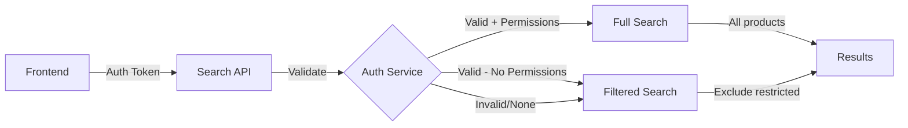

# Restricted Item Access Control Design

## Overview

Implement access control for restricted items (Beckman/Olympus products) that require special account permissions to view and search.

## Business Requirements

### Three Restricted Classes

Mercedes Scientific has **3 distinct restricted classes** of products, each with different visibility and purchase rules:

#### 1. FUO (Forensic Use Only)
- **SQL Value**: `"FORENSIC USE ONLY"`
- **Database Field**: `restricted_class_id` in `customer_x_restricted_class` table
- **Visibility**: ✅ Customers **CAN see** items in search results
- **Purchase**: ❌ Customers **CANNOT add to cart** without permissions
- **Authorization Process**: Form required at https://marketing.mercedesscientific.com/en-us/fuo-form
- **Use Case**: Forensic laboratory products requiring special certification

#### 2. CLIA Waived (Clinical Laboratory Improvement Amendments)
- **SQL Value**: `"CLIA WV"`
- **Database Field**: `restricted_class_id` in `customer_x_restricted_class` table
- **Visibility**: ✅ Customers **CAN see** items in search results
- **Purchase**: ❌ Customers **CANNOT add to cart** without permissions
- **Authorization Process**: CLIA license must be submitted to CLIA@Mercedesscientific.com
- **Use Case**: Clinical diagnostic products requiring CLIA certification

#### 3. Alternative Sourced Items
- **SQL Value**: `"ALT SOURCE"`
- **Database Field**: `restricted_class_id` in `customer_x_restricted_class` table
- **Visibility**: ❌ Customers **CANNOT see** items unless logged in AND have permissions
- **Purchase**: ❌ Requires permissions to even view
- **Authorization Process**: Typically only given when customer has quoted or purchased these items
- **Use Case**: Third-party distributor products (e.g., Beckman Coulter, Olympus)
- **Reason**: Mercedes Scientific is NOT an authorized distributor for these brands

### Access Control Rules Summary

| Restricted Class | Visible in Search? | Can Add to Cart? | Authorization Required? |
|-----------------|-------------------|------------------|------------------------|
| **FUO** | ✅ Yes (all users) | ❌ No (requires permission) | Form submission |
| **CLIA WV** | ✅ Yes (all users) | ❌ No (requires permission) | CLIA license |
| **ALT SOURCE** | ❌ No (hidden) | ❌ No (requires permission) | Quote/purchase history |

**For non-authenticated users OR users without permissions:**
- **FUO items**: Visible in search, visible on product page, cannot add to cart
- **CLIA WV items**: Visible in search, visible on product page, cannot add to cart
- **ALT SOURCE items**: Completely hidden (not in search, not accessible via direct URL)

**For authenticated users with permissions:**
- **FUO items**: Visible, can add to cart (form submitted and approved)
- **CLIA WV items**: Visible, can add to cart (CLIA license verified)
- **ALT SOURCE items**: Visible in search and product pages, can add to cart

## Technical Design

### 1. Restriction Identification

**Database Structure** (from Magento):
```sql
-- Main restricted class definitions
TABLE: restricted_class
  - class_id (char(255)) - Primary key: "FORENSIC USE ONLY", "CLIA WV", "ALT SOURCE"

-- Customer-to-restriction mappings
TABLE: customer_x_restricted_class
  - customer_id (int)
  - restricted_class_id (char(255)) - FK to restricted_class.class_id

-- Product-to-restriction mapping (TBD - needs verification)
-- Could be one of:
--   1. Column in catalog_products table
--   2. Field in additional_attributes JSON
--   3. Separate product_x_restricted_class table
```

**Product-Restriction Mapping Options**:

**Option 1: Field in catalog_products table**
```sql
-- If restricted_class_id is directly in catalog_products
SELECT sku, restricted_class_id
FROM catalog_products
WHERE sku = 'BEY 8546733'
```

**Option 2: Field in additional_attributes JSON** (Current Implementation)
```python
# The indexer already handles this:
# additional_attributes = "brand=Beckman Coulter,restricted_class=ALT SOURCE"
# Parsed by _parse_additional_attributes() method in indexer_neon.py
```

**Option 3: Separate mapping table**
```sql
-- If there's a product_x_restricted_class table
SELECT p.sku, prc.restricted_class_id
FROM catalog_products p
LEFT JOIN product_x_restricted_class prc ON p.product_id = prc.product_id
WHERE p.sku = 'BEY 8546733'

-- Query update needed for indexer if using this option:
WITH merged_products AS (
    SELECT
        p.sku,
        -- ... existing fields ...
        MAX(CASE WHEN p.store_view_code IS NULL THEN prc.restricted_class_id END) as restricted_class_id
    FROM catalog_products p
    LEFT JOIN product_x_restricted_class prc ON p.product_id = prc.product_id
    WHERE (p.store_view_code IS NULL OR p.store_view_code = 'mercedesscientific')
      AND p.is_in_stock = '1'
      AND p.sku IS NOT NULL
    GROUP BY p.sku
)
SELECT sku, restricted_class_id, -- ... other fields ...
FROM merged_products
WHERE COALESCE(name_null, name_mercedes) IS NOT NULL
```

**Current Indexer Status**:

The indexer (`src/indexer_neon.py`) is configured for **Option 2** (additional_attributes):
- ✅ Includes `restricted_class` field in Typesense schema (line 85)
- ✅ Parses `restricted_class` from additional_attributes (line 531)
- ✅ Includes in product document (line 486)

**Action Required**:
- Query Neon database to verify which option is actually used
- If Option 1 or 3, update the SQL query in `fetch_products_from_neon()`

**Restriction Constants**:
```python
class RestrictedClass:
    """Restricted class constants."""
    FORENSIC_USE_ONLY = "FORENSIC USE ONLY"
    CLIA_WAIVED = "CLIA WV"
    ALT_SOURCE = "ALT SOURCE"

    # All restricted classes
    ALL = [FORENSIC_USE_ONLY, CLIA_WAIVED, ALT_SOURCE]

    # Classes that are visible to all users (but not purchasable)
    VISIBLE_CLASSES = [FORENSIC_USE_ONLY, CLIA_WAIVED]

    # Classes that are hidden from unauthorized users
    HIDDEN_CLASSES = [ALT_SOURCE]
```

### 2. User Authentication

**Authentication Flow:**


**Request Headers:**
```
Authorization: Bearer <token>
X-Customer-Group: <group_id>
X-Customer-Permissions: beckman_access,olympus_access
```

**Alternative (Session-based):**
```
Cookie: session_id=<session_id>
```

### 3. Search API Modifications

#### Request Model
```python
class SearchRequest(BaseModel):
    query: str
    max_results: int = 20
    # Optional: User authentication token
    auth_token: Optional[str] = None
    # Optional: User permissions (comma-separated)
    permissions: Optional[str] = None
```

#### Authentication Middleware
```python
async def get_user_permissions(request: Request) -> Dict[str, Any]:
    """Extract and validate user permissions from request."""
    # Check Authorization header
    auth_header = request.headers.get("Authorization")
    # Check custom permission headers
    permissions = request.headers.get("X-Customer-Permissions", "")

    return {
        "authenticated": bool(auth_header),
        "has_beckman_access": "beckman_access" in permissions,
        "has_olympus_access": "olympus_access" in permissions,
        "has_restricted_access": "restricted_access" in permissions
    }
```

#### Restriction Filter Logic
```python
def build_restriction_filter(user_permissions: Dict[str, Any]) -> str:
    """
    Build Typesense filter to handle restricted items based on user permissions.

    Rules:
    1. FUO and CLIA WV: Always visible (no filtering needed)
    2. ALT SOURCE: Hidden unless user has restricted_access permission

    Args:
        user_permissions: Dict with permission flags

    Returns:
        Typesense filter_by string to exclude hidden items
    """
    # If user has restricted access, show everything (no filter)
    if user_permissions.get("has_restricted_access"):
        return ""

    # Otherwise, exclude ALT SOURCE items (but allow FUO and CLIA WV)
    # Use != to exclude only ALT SOURCE
    return "restricted_class:!=[ALT SOURCE]"
```

### 4. Typesense Schema Updates

**Add `restricted_class` field to schema**:
```python
{
    "name": "restricted_class",
    "type": "string",
    "facet": True,
    "optional": True,
    "index": True
}
```

**Possible Values**:
- `"FORENSIC USE ONLY"` - FUO restricted
- `"CLIA WV"` - CLIA Waived restricted
- `"ALT SOURCE"` - Alternative sourced (hidden by default)
- `null` or empty - Not restricted (normal product)

**Filter Application in Search**:
```python
def search(query: str, user_permissions: Dict[str, Any]) -> SearchResults:
    """Execute search with restriction filtering."""
    search_params = {
        "q": query,
        "query_by": "name,description,sku,categories",
        "per_page": 20
    }

    # Apply restriction filter
    filter_by = build_restriction_filter(user_permissions)
    if filter_by:
        # Combine with any existing filters
        existing_filter = search_params.get("filter_by", "")
        if existing_filter:
            search_params["filter_by"] = f"{existing_filter} && {filter_by}"
        else:
            search_params["filter_by"] = filter_by

    return typesense_client.search(search_params)
```

### 5. Direct URL Access Control

**Product Detail Endpoint (New)**
```python
@app.get("/api/product/{product_id}")
async def get_product(product_id: str, request: Request):
    """Get product by ID with restriction check."""
    # Get user permissions
    user_perms = await get_user_permissions(request)

    # Fetch product
    product = fetch_product_from_typesense(product_id)

    # Check if restricted
    if is_restricted_product(product.brand, product.sku):
        if not user_perms.get("has_restricted_access"):
            raise HTTPException(404, "Product not found")

    return product
```

### 6. Configuration

**Environment Variables**
```bash
# Restricted item configuration
RESTRICTED_BRANDS=Beckman Coulter,Olympus
RESTRICTED_SKU_PREFIXES=BEY,OSR

# Authentication (optional - for future)
AUTH_SERVICE_URL=https://www.mercedesscientific.com/api/auth
AUTH_ENABLED=false  # Start with false, enable later
```

**Config Class**
```python
class Config:
    # Existing config...

    # Restricted items
    RESTRICTED_BRANDS = os.getenv("RESTRICTED_BRANDS", "Beckman Coulter,Olympus").split(",")
    RESTRICTED_SKU_PREFIXES = os.getenv("RESTRICTED_SKU_PREFIXES", "BEY,OSR").split(",")

    # Authentication
    AUTH_ENABLED = os.getenv("AUTH_ENABLED", "false").lower() == "true"
    AUTH_SERVICE_URL = os.getenv("AUTH_SERVICE_URL", "")
```

## Implementation Phases

### Phase 1: Basic Restriction (No Authentication)
**Status:** Can implement immediately
- Add restriction configuration
- Add restriction filter to search queries
- Filter out Beckman/Olympus by default
- **Result:** All users see filtered results (no restricted items)

### Phase 2: Authentication Integration
**Status:** Requires stakeholder input
- Implement authentication middleware
- Validate user permissions
- Apply restriction filters conditionally
- **Result:** Authorized users see restricted items

### Phase 3: Direct Access Control
**Status:** After Phase 2
- Add product detail endpoint
- Implement restriction check for direct access
- **Result:** Block direct URL access for unauthorized users

### Phase 4: Frontend Integration
**Status:** After Phase 2
- Pass auth token from frontend to API
- Display disclaimers for restricted items
- **Result:** Complete user experience

## Testing Strategy

### Test Cases

**1. Non-authenticated user search "beckman"**
- Expected: 0 results

**2. Authenticated user without permissions search "beckman"**
- Expected: 0 results

**3. Authenticated user with permissions search "beckman"**
- Expected: ~231 Beckman Coulter products

**4. Direct URL access to restricted product (unauthorized)**
- Expected: 404 Not Found

**5. Direct URL access to restricted product (authorized)**
- Expected: Product details with disclaimer

**6. Search for non-restricted products**
- Expected: All users see same results

### Test Implementation
```python
# Test file: tests/test_restricted_items.py

def test_search_restricted_items_no_auth():
    """Non-authenticated users should not see restricted items."""
    response = client.post("/api/search", json={"query": "beckman"})
    assert response.json()["total"] == 0

def test_search_restricted_items_with_auth():
    """Authenticated users with permissions should see restricted items."""
    response = client.post(
        "/api/search",
        json={"query": "beckman"},
        headers={"X-Customer-Permissions": "restricted_access"}
    )
    assert response.json()["total"] > 0
```

## Product Count Analysis

Based on database analysis:
- **231** Beckman Coulter branded products
- **146** Olympus branded products (mix of genuine and compatible)
- **~377 total** potentially restricted products

**Breakdown:**
- BEY* SKUs: Genuine Beckman products
- OSR* SKUs: Genuine Olympus reagents
- Other products: Compatible/third-party (may not need restriction)

## Questions for Stakeholder

1. ✅ Are ALL Beckman Coulter and Olympus branded products restricted?
2. ✅ What authentication method does the main website use?
3. ✅ What permission field/flag indicates restricted item access?
4. ✅ Should compatible/third-party products (not genuine Beckman/Olympus) also be restricted?
5. ✅ What should the disclaimer text be for authorized users?

## Next Steps

1. ✅ Get stakeholder answers to questions
2. Implement Phase 1 (basic restriction without auth)
3. Test Phase 1 implementation
4. Get authentication integration details
5. Implement Phase 2 (with authentication)
6. Implement Phase 3 (direct access control)
7. Frontend integration

---

**Created:** 2025-11-11
**Status:** Design Phase - Awaiting stakeholder input
**Ticket:** JAI-2166
