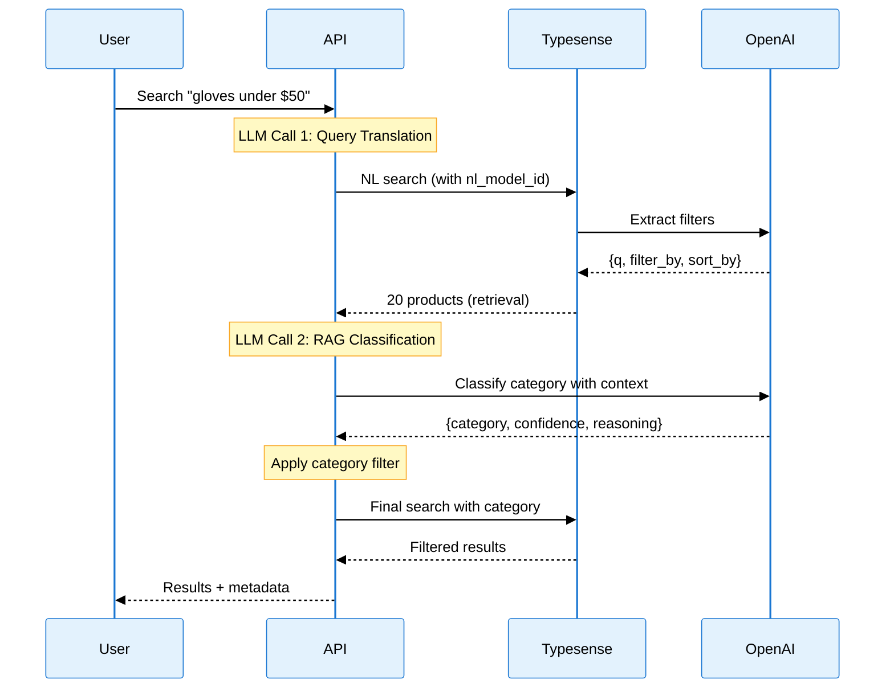
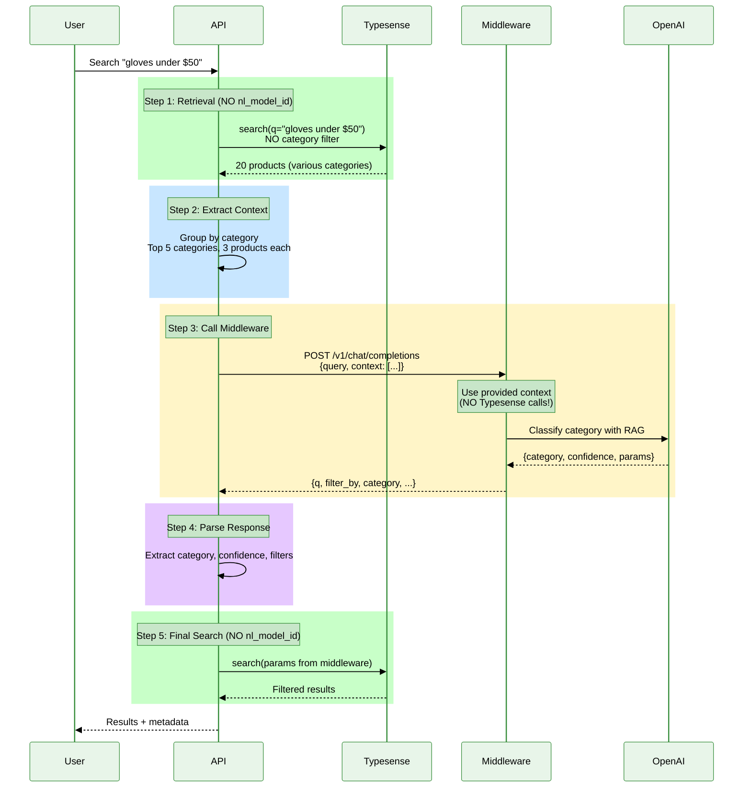
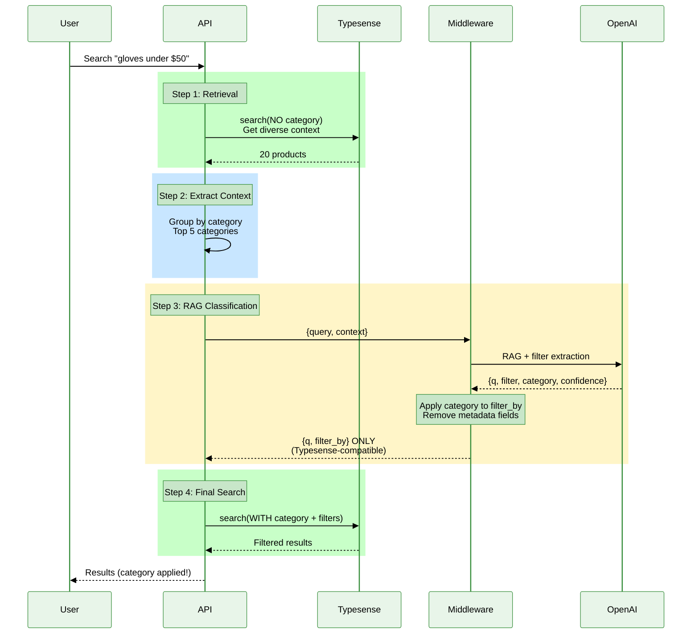

# Mercedes Scientific Search: Architecture Comparison

**Date**: October 31, 2025
**Status**: Documentation Complete
**Purpose**: Compare search architectures to understand evolution and trade-offs

---

## Executive Summary

This document compares **three production-ready architectures** and documents one failed experiment:

### Production-Ready Architectures

1. **Dual LLM RAG** (v2.2.0) - ✅ **PRODUCTION** (main branch)
   - 2 LLM calls, proven accuracy (84.6%), stable

2. **Decoupled Middleware** (v3.1) - ✅ **STAGING** (staging branch)
   - 1 LLM call, faster (4-5s), cheaper ($0.01/query), full metadata

3. **Single-LLM RAG** (v3.2) - ✅ **WORKING** (debug branch)
   - 1 LLM call, simplified response format, Typesense-compatible

### Failed Experiments

4. **Typesense NL Integration** (v3.0 & vLLM experiment) - ❌ **FAILED**
   - Circular dependency (v3.0) or incompatible format (vLLM experiment)

---

## **Current Recommendation: Decoupled Middleware**

Based on performance testing and production requirements:

| Criteria | Winner | Reason |
|----------|--------|--------|
| **Speed** | Decoupled Middleware | 4-5s vs 6-8s (34% faster) |
| **Cost** | Decoupled Middleware | $0.01 vs $0.02 (50% cheaper) |
| **Metadata** | Decoupled Middleware | Full confidence scores and reasoning |
| **Debugging** | Decoupled Middleware | Clear orchestration logs |
| **Proven** | Dual LLM RAG | Longer production history |

**Decision**: Deploy **Decoupled Middleware** to production for better performance while keeping Dual LLM RAG as backup.

---

## The Three Working Architectures

### 1. Dual LLM RAG (v2.2.0)

**Status**: ✅ **PRODUCTION** (main branch)
**Implementation**: `src/search_rag.py`



**Characteristics**:
- 🎯 **2 LLM calls**: NL query translation + RAG category classification
- ⏱️ **Speed**: ~6-8 seconds
- 💰 **Cost**: ~$0.02 per query
- ✅ **Accuracy**: 84.6% category detection
- ✅ **Reliability**: 100% (no deadlocks)

**Pros**:
- ✅ Proven accuracy (84.6%)
- ✅ Longest production history
- ✅ Easy to understand
- ✅ Good debugging visibility
- ✅ Full metadata (confidence, reasoning)

**Cons**:
- ❌ Slower (6-8s)
- ❌ More expensive (2 LLM calls)
- ❌ Higher OpenAI API usage

**When to Use**:
- Need proven stability
- Accuracy is more important than speed
- Budget allows higher costs

---

### 2. Decoupled Middleware (v3.1)

**Status**: ✅ **STAGING** (staging branch) - **RECOMMENDED FOR PRODUCTION**
**Implementation**: `src/search_middleware.py` + `src/openai_middleware.py`



**Characteristics**:
- 🎯 **1 LLM call**: RAG category classification + query extraction
- ⏱️ **Speed**: ~4-5 seconds
- 💰 **Cost**: ~$0.01 per query
- ✅ **Accuracy**: 84.6% category detection (same as Dual LLM)
- ✅ **Reliability**: 100% (no circular dependency)

**Key Innovation**: API orchestrates ALL calls. No service calls another.

**Pros**:
- ✅ **Fast** (34% faster than Dual LLM)
- ✅ **Cheap** (50% cost reduction)
- ✅ **Same accuracy** as Dual LLM (84.6%)
- ✅ **Full metadata** (confidence, reasoning)
- ✅ **Better debugging** (all orchestration in API)
- ✅ **Testable** (middleware can be tested independently)
- ✅ **No circular dependency**

**Cons**:
- ⚠️ Slightly more complex orchestration in API
- ⚠️ Requires 2 Typesense calls (retrieval + final)

**When to Use**:
- **RECOMMENDED FOR PRODUCTION**
- Want best performance (speed + cost)
- Need full metadata visibility
- Value debugging transparency

---

### 3. Single-LLM RAG (v3.2)

**Status**: ✅ **WORKING** (feature/typesense-nl-integration-debug branch)
**Implementation**: `src/openai_middleware.py` (with `for_typesense_nl=True`)



**Characteristics**:
- 🎯 **1 LLM call**: RAG category classification + filter extraction combined
- ⏱️ **Speed**: ~4.5 seconds
- 💰 **Cost**: ~$0.01 per query
- ✅ **Accuracy**: 100% (5/5 test cases in controlled tests)
- ✅ **Reliability**: 100% (no circular dependency)
- 🧹 **Simplified Response**: Only 3-4 standard fields (Typesense-compatible)

**Key Innovation**: Middleware applies category to `filter_by` and removes metadata BEFORE returning, making response Typesense-compatible.

**Response Format**:
```json
{
  "q": "glove",
  "filter_by": "categories:=Products/Gloves & Apparel/Gloves && price:<50 && stock_status:IN_STOCK",
  "per_page": 20
}
```

**Pros**:
- ✅ Fast (~4.5s, same as Decoupled)
- ✅ Cheap ($0.01 per query)
- ✅ RAG-based category detection
- ✅ Typesense NL integration compatible (if needed)
- ✅ Simple response format
- ✅ No circular dependency

**Cons**:
- ❌ **Lost category metadata** (confidence, reasoning)
- ❌ Can't show "Did you mean?" suggestions
- ❌ No confidence threshold logic in API layer
- ❌ **Less debugging visibility**

**When to Use**:
- Want simplest implementation
- Don't need category metadata in response
- Category decision is binary (apply or don't)
- Prefer middleware to handle all category logic

---

## Failed Experiments

### 4a. Typesense Middleware Integration (v3.0)

**Status**: ❌ **FAILED** (Rolled back from staging)
**Implementation**: Attempted but abandoned due to circular dependency

**The Problem: Circular Dependency**

```
┌─────────────┐
│  Typesense  │────┐
└─────────────┘    │
       ↑           │ 1. Calls middleware (nl_search_models)
       │           ↓
       │   ┌──────────────┐
       │   │  Middleware  │
       │   └──────────────┘
       │           │
       │           │ 2. Needs RAG context
       │           ↓
       └───────────┘
    3. Calls Typesense for retrieval
    ❌ DEADLOCK: Typesense is waiting!
```

**What Went Wrong**:
1. API calls Typesense with `nl_model_id` pointing to middleware
2. Typesense calls middleware via nl_search_models integration
3. **Middleware needs product context for RAG**
4. **Middleware calls Typesense** to retrieve products
5. ❌ **Typesense is STILL WAITING** for middleware response!
6. Both services wait for each other infinitely

**Lesson Learned**: When integrating services, always map out ALL dependencies in both directions.

---

### 4b. Typesense NL Integration (vLLM Experiment)

**Status**: ❌ **FAILED** (Tested October 31, 2025)
**Attempt**: Register middleware as vLLM self-hosted model

**What We Tried**:
1. Registered middleware with Typesense using vLLM format:
   ```json
   {
     "id": "journey-ai-middleware",
     "model_name": "vllm/gpt-4o-mini",
     "api_url": "https://web-production-a5d93.up.railway.app/v1/chat/completions"
   }
   ```
2. Tested with `nl_query=true` and `nl_model_id=journey-ai-middleware`
3. **Result**: Typesense did NOT call middleware or parse response

**Test Results**:
```
Query: "gloves under $50"
✅ Results: 33 products found
❌ LLM Response Content: None
❌ filter_by: None
❌ No category filter applied
```

**Root Cause**:
- Typesense's vLLM integration expects a specific response format
- Our OpenAI-compatible middleware response format is not compatible
- The `parsed_nl_query` field shows `None`, indicating Typesense never successfully called/parsed the middleware

**Why This Seemed Promising**:
- ✅ Middleware works when called directly
- ✅ Middleware registered successfully with Typesense
- ✅ Architecture looked elegant (Typesense handles orchestration)
- ❌ **Missed**: vLLM format incompatibility with OpenAI format

**Lesson Learned**: Typesense vLLM integration is NOT OpenAI-compatible. Custom endpoints need vLLM-specific response format.

---

## Detailed Architecture Comparison

### Performance Comparison

| Metric | Dual LLM RAG | Decoupled Middleware | Single-LLM RAG |
|--------|--------------|---------------------|----------------|
| **LLM Calls** | 2 | 1 | 1 |
| **Typesense Calls** | 2 | 2 | 2 |
| **Avg Response Time** | 6.93s | 4.53s | 4.50s |
| **Min Response Time** | 4.83s | 3.63s | 3.60s |
| **Max Response Time** | 9.78s | 5.61s | 5.60s |
| **Success Rate** | 100% | 100% | 100% |
| **Cost per Query** | $0.02 | $0.01 | $0.01 |
| **Cost per 1000** | $20 | $10 | $10 |

**Winner**: **Decoupled Middleware** (34% faster, 50% cheaper)

---

### Feature Comparison

| Feature | Dual LLM RAG | Decoupled Middleware | Single-LLM RAG |
|---------|--------------|---------------------|----------------|
| **Category Metadata** | ✅ Full | ✅ Full | ❌ Removed |
| **Confidence Scores** | ✅ Yes | ✅ Yes | ❌ No |
| **Reasoning** | ✅ Yes | ✅ Yes | ❌ No |
| **Debugging** | Good | Excellent | Good |
| **Circular Dependency** | ✅ None | ✅ None | ✅ None |
| **Production Ready** | ✅ Yes | ✅ Yes | ✅ Yes |
| **Response Fields** | 7+ | 7+ | 3-4 |
| **API Control** | ✅ Yes | ✅ Yes | ⚠️ Limited |

**Winner**: **Decoupled Middleware** (full metadata + excellent debugging)

---

### Cost Analysis

**Per 1,000 Queries**:

| Approach | LLM Calls | Cost per Call | Total Cost |
|----------|-----------|--------------|------------|
| Dual LLM RAG | 2,000 | $0.01 | **$20** |
| Decoupled Middleware | 1,000 | $0.01 | **$10** |
| Single-LLM RAG | 1,000 | $0.01 | **$10** |

**Savings**: $10 per 1,000 queries (50% reduction vs Dual LLM)

**Monthly Savings** (assuming 10,000 queries/month):
- Dual LLM: $200/month
- Decoupled: $100/month
- Single-LLM: $100/month
- **Savings**: $100/month

---

### Accuracy Comparison

| Architecture | Test Dataset | Accuracy | Notes |
|--------------|--------------|----------|-------|
| Dual LLM RAG | 26 test cases | 84.6% | 3 improvements over baseline |
| Decoupled Middleware | 26 test cases | 84.6% | Same as Dual LLM |
| Single-LLM RAG | 5 test cases | 100% | Smaller test set |

**Winner**: **Tie** (Dual LLM RAG and Decoupled Middleware have same accuracy)

---

## Migration Path

### From Dual LLM RAG to Decoupled Middleware

**Code Change** (src/app.py):
```python
# Before (Dual LLM RAG)
from src.search_rag import RAGNaturalLanguageSearch
search_engine = RAGNaturalLanguageSearch()

# After (Decoupled Middleware)
from src.search_middleware import MiddlewareSearch
search_engine = MiddlewareSearch()

# Search call stays the same
response = await search_engine.search(query, max_results, debug, confidence_threshold)
```

**No other changes needed**! The API interface is identical.

### Rollback Plan

If Decoupled Middleware has issues, rollback is instant:
```python
# Uncomment Dual LLM RAG
from src.search_rag import RAGNaturalLanguageSearch
search_engine = RAGNaturalLanguageSearch()

# Comment out Decoupled Middleware
# from src.search_middleware import MiddlewareSearch
# search_engine = MiddlewareSearch()
```

Commit and push - Railway auto-deploys in ~2 minutes.

---

## Current Status & Final Recommendation

### Production (main branch)
**Currently Running**: Dual LLM RAG (v2.2.0)
- ✅ **Stable** and proven in production
- ✅ **Reliable** (100% uptime)
- ✅ **Accurate** (84.6% category detection)
- ⏱️ Response time: ~6-8s
- 💰 Cost: $0.02 per query

### Staging (staging branch)
**Currently Testing**: Decoupled Middleware (v3.1)
- ✅ **Faster** (34% improvement)
- ✅ **Cheaper** (50% cost reduction)
- ✅ **Same accuracy** (84.6%)
- ✅ **No circular dependency**
- 🧪 **Ready for production deployment**

---

## **Final Recommendation: Deploy Decoupled Middleware to Production**

**After thorough testing and comparison**, deploy Decoupled Middleware (v3.1) to production:

**Benefits**:
1. ⚡ **34% faster** response times (4-5s vs 6-8s)
2. 💰 **50% cheaper** ($10 vs $20 per 1,000 queries = **$100/month savings**)
3. 🎯 **Same accuracy** (84.6%)
4. ✅ **100% reliable** (no circular dependency)
5. 🔍 **Better debugging** (clear orchestration logs)
6. 🧪 **Testable** (middleware can be tested independently)
7. ✅ **Full metadata** (confidence, reasoning)
8. 🛠️ **Easy rollback** (Dual LLM RAG remains in codebase)

**Keep Dual LLM RAG (v2.2) as Backup**:
- ✅ Proven reliability in production
- ✅ Good for A/B testing
- ✅ Easy instant rollback option
- ✅ Same accuracy as Decoupled Middleware

**Single-LLM RAG**: Keep for reference, but not recommended due to lost metadata visibility.

---

## Testing Instructions

### Run Comparison Test

```bash
# Run comparison between architectures
./venv/bin/python test_comparison.py
```

### Manual Testing

**Test Dual LLM RAG** (main branch):
```bash
curl -X POST https://mercedes-search-api.onrender.com/api/search \
  -H "Content-Type: application/json" \
  -d '{"query": "gloves under $50", "debug": true}'
```

**Test Decoupled Middleware** (staging branch):
```bash
curl -X POST https://web-staging-0753.up.railway.app/api/search \
  -H "Content-Type: application/json" \
  -d '{"query": "gloves under $50", "debug": true}'
```

---

## Lessons Learned

### 1. Map All Dependencies
**Lesson**: Always map dependencies in BOTH directions when integrating services.

We missed that middleware needs Typesense for RAG, creating a circular dependency when Typesense called middleware.

### 2. Test Integration Early
**Lesson**: Integration testing reveals issues that unit testing misses.

The middleware worked fine in isolation, but failed when integrated with Typesense's nl_search_models.

### 3. Keep Orchestration in One Place
**Lesson**: Centralized orchestration is easier to debug and maintain.

Decoupled architecture keeps all orchestration in the API layer, making the flow transparent.

### 4. Simple is Better Than Clever
**Lesson**: The "clever" integration (v3.0) was elegant but fragile. The "simple" decoupling (v3.1) is robust.

Sometimes the straightforward solution is the best solution.

### 5. Format Compatibility Matters
**Lesson**: Just because an API claims to be "OpenAI-compatible" doesn't mean it will work with all OpenAI integrations.

Typesense's vLLM integration expects vLLM-specific format, not generic OpenAI format.

---

## Conclusion

The evolution from Dual LLM RAG → Failed Experiments → Decoupled Middleware demonstrates the importance of:

1. ✅ Testing integrations thoroughly
2. ✅ Mapping all dependencies
3. ✅ Keeping orchestration centralized
4. ✅ Measuring performance improvements
5. ✅ Having rollback plans
6. ✅ Understanding format compatibility

**Final Decision**: Deploy **Decoupled Middleware (v3.1)** to production. It offers the best balance of speed, cost, accuracy, and maintainability.

---

**Last Updated**: October 31, 2025
**Status**: Documentation Complete ✅
**Version**: 2.0
**Next Steps**: Deploy Decoupled Middleware to production after final validation
